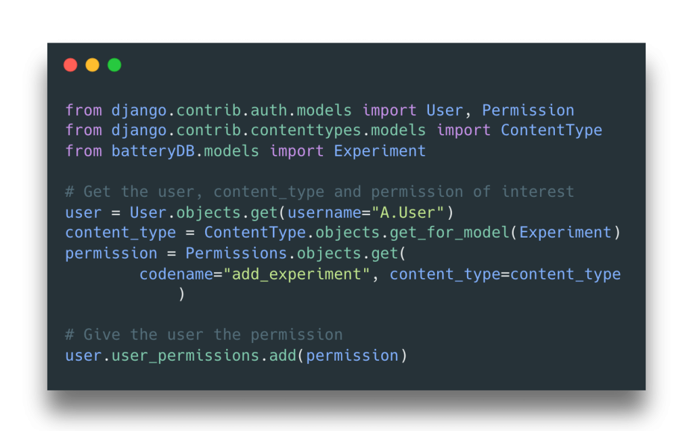
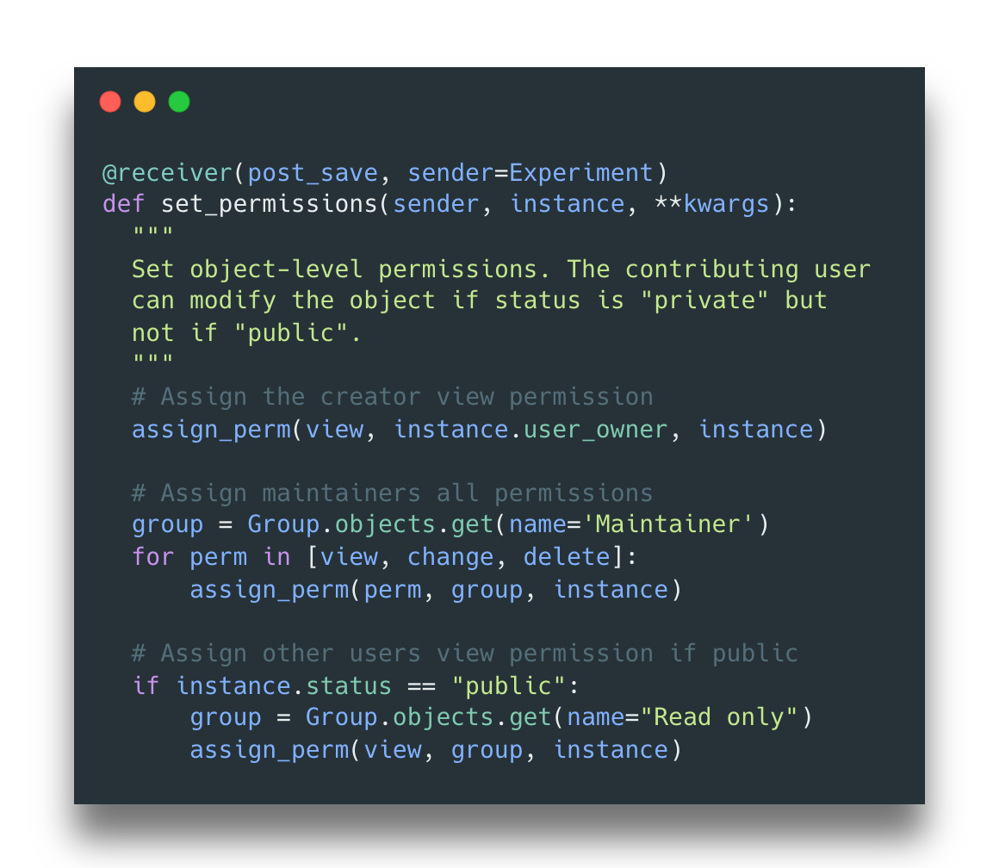

# Fine Tuning Django User Permissions

*Read the full blog post [in Dan Davies's Blog](https://dandavies99.github.io/posts/2021/11/django-permissions/).*

The RSE team is involved in an increasing number of software projects requiring a front-end web app. The main advantage to having a web app element for your research software is that users can interact with it via a web browser, without having to install anything to their local machine. There are of course downsides, including the need to deploy, host and maintain software somewhere suitable. However, there is a wide range of popular frameworks to make the whole process a lot smoother.

<!-- more -->

User permissions are an important consideration for any web app. This is not necessarily just to do with overall security, but how you might want different types of users – with different roles – to interact with your software. For example, it is common to require admin users to be able to perform a wide variety of actions, while the majority of users should only be able to perform a small subset of actions. The degree of complexity required will depend on the overall aim.

We frequently use the [Django](https://www.djangoproject.com/) web framework, which facilitates the creation of web apps solely in Python. [This blog post](https://dandavies99.github.io/posts/2021/11/django-permissions/) covers aspects of user management and permissions within Django, which Dan has learned about and implemented while working on a web-based database to store and visualise sets of experimental data. It covers some basics such as how to assign permissions to user and groups of users, as well as more advanced topics such as setting up automatic permissions when specific objects are created. We hope it will be useful to the wider RSE community and beyond!

<!-- markdownlint-disable-next-line MD036 -->
*Fig. 1: Simple permission assignment in Django*

<!-- markdownlint-disable-next-line MD036 -->
*Fig. 2: Automatic permission assignment for specific objects in Django*
