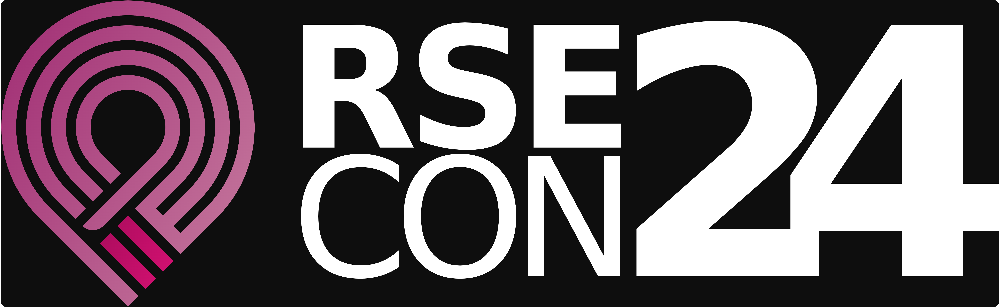

# RSECon24: Growing a community, building a career

{: .no-caption style="width:69%" }

It's now a little over 12 years since the term "Research Software Engineering" (RSE) was first coined at an [event held in Oxford, UK](https://www.software.ac.uk/blog/not-so-brief-history-research-software-engineers-0). Seeing around 400 people gather at the Frederick Douglass Centre at Newcastle University for this year's RSE Conference - [RSECon24](https://rsecon24.society-rse.org/) - was proof of the amazing growth that we've seen within the community and the wide range of opportunities that now exist to undertake software development work within the research domain. We know that career opportunities within the research technical professionals space are also expanding rapidly but there's still a way to go in recognising and rewarding the people who contribute vital technical skills to support and undertake research. This year's conference offered a wide range of talks, workshops and Birds of a Feather (BoF) sessions, alongside a great opportunity to network with other RSEs and researchers and catch up with friends both old and new. This growth of the community, opportunities for the future and how we can help to support and grow careers, as well as making our community more diverse and inclusive, were some of the topics covered at this year's conference. Several members of the Imperial College London Research Computing Service were in attendance at the conference, as were other RSEs and researchers from departments across the institution. In this blog post, we talk about our experiences, highlights and key takeaways from this year's conference.

<!-- more -->

## Technical Highlights

### R Development Hackathon

The [R Contribution Working Group](https://contributor.r-project.org/) organises the “R Dev Days” where people come together to contribute to the code and documentation that gets distributed in binary versions of R (base R, the recommended packages and the Windows/macOS GUIs). At RSECon24, Saranjeet Kaur Bhogal co-organised the R Development Hackathon with Heather Turner and Nick Tierney which followed the format of these Dev Days, where current and novice contributors work collaboratively on selected issues, with the goal of making progress on these issues and learning more about the R Development process along the way. During the hackathon, a [number of issues](https://github.com/r-devel/r-dev-day/issues?q=is%3Aissue+is%3Aopen+label%3ARSECon24) were touched upon including translations, R documentation, existing bugs on Bugzilla, etc.

### Databases/query languages

Tuesday included two sessions about query languages. The first provided a detailed look at GraphQL, a web framework providing API endpoints able to handle arbitrarily complex queries à la SQL, in contrast to RESTful APIs, which are less flexible. Next was a workshop about SPARQL, a query language for data in the Resource Description Format (RDF), which is widely used in some fields. Participants were shown how to construct complex queries using public datasets (for example, the [Wikidata Query Service](https://query.wikidata.org/)).
<!-- markdown-link-check-disable-next-line -->
On the Wednesday, there was a practical workshop on the ubiquitous SQLite database, including a detailed walkthrough of entering and manipulating data using the [DB Browser for SQLite](https://sqlitebrowser.org/) graphical software. Another tool that was mentioned was [ETL Helper](https://github.com/BritishGeologicalSurvey/etlhelper), developed in house by the British Geological Society, which helps with transferring data into and out of databases, including SQLite.

### Working better with Python/Software

With Python being one of the most popular languages in the RSE community, there were naturally several talks and workshops on how to up your game when it comes to writing software with Python.

Writing optimised, performant Python code is not often at the top of the list of priorities for Python programmers ([The Zen of Python](https://peps.python.org/pep-0020/) claims "now is better than never" to discourage premature optimisation). However there _are_ ways to write faster Python code, as was highlighted by Robert Chisholm where he outlined a number of [simple strategies to do so](https://rse.shef.ac.uk/pando-python/ppp), as well as some profiling tools.

Developing a Python package that conforms to all of the best recommendations can be challenging. There are many ways to structure it and the recommendations seem to constantly change. This only gets more difficult when you consider what to include for the best quality _research_ software. In a workshop, we were shown how to easily build a python package (or update an existing one) using [The Netherlands eScience Centre Python Template]( https://research-software-directory.org/software/nlesc-python-template).

Writing tests is a very important part of writing high quality software. Having a suite of comprehensive tests provides confidence that the software is working as intended, and can catch unintentional changes in behaviour while you're making changes. How do you write good tests? Abhishek Dasgupta demonstrated some advanced Python testing concepts like [mocking](https://docs.python.org/3/library/unittest.mock-examples.html), [property-based testing](https://hypothesis.works/articles/getting-started-with-hypothesis/) and [snapshot testing](https://github.com/syrupy-project/syrupy). How do you make sure you have sufficient test coverage? Thomas Hawes ran a workshop on how [Test Driven Development](https://github.com/UniExeterRSE/rsecon24-tdd-workshop/tree/main) can not only improve your test coverage, but also improve the quality of the code and your development efficiency.

### Various reproducibility-related talks

Reproducibility of research is fundamental to the scientific method, and as research increasingly relies on software-generated results, the RSE community has recognised the need to [advocate for research software reproducibility](https://www.software.ac.uk/about-us/manifesto). One particular workshop focused on what we, as RSEs, can do to influence practices within our organisation, introducing a [framework for scaling up reproducibility practices in research organisations](https://zenodo.org/records/10664660).

On the Tuesday there was a talk about "[Reproducible distributed research in practice](https://virtual.oxfordabstracts.com/#/event/49081/submission/148)", which proposed starting researchers with a simple form of reproducibility, where inputs and outputs of scripts are tracked along with the contents, with the aim of having a less steep learning curve than technologies like Docker. To this end, they have made available packages for R ([orderly2](https://mrc-ide.github.io/orderly2/)) and Python ([pyorderly](https://github.com/mrc-ide/pyorderly)) which facilitate this approach.

Although software has become a predominant part of the scientific process, the true impact of RSEs is sometimes hard to evidence. This lack of evidence is in part because purely scientific publications tend to leave little place for the software part of the research process while favouring the scientific results themselves. In 2016, the [Journal of Open Source Software (JOSS)](https://joss.theoj.org) was created to tackle this issue. JOSS is a peer-reviewed academic journal created with the objective of publishing papers about research software itself, giving the RSE world a route for recognition. A walkthrough provided an overview of the types of [submissions published in JOSS](https://joss.readthedocs.io/en/latest/submitting.html) and demonstrated the full life-cycle of the JOSS process, from the submission of the software and paper, to the review process and the final publication - explaining both sides of the coin: the submitter and reviewer's point of views.

### Community sessions at the conference

The final day of RSECon24 was dedicated to RSE communities with workshops and Birds of a Feather (BoF) sessions, covering topics from project management and career development through to RSE Worldwide communities.

RSE careers are still an issue for the community with unclear pathways and routes into the profession. Several sessions tried to tackle this topic in different ways. There was a [BoF on RSE training and technical development](https://virtual.oxfordabstracts.com/#/event/49081/submission/79) where training for and by RSEs was discussed alongside topics like creating a Career Progression Framework. There was an attempt to further develop the [RSE Competencies Toolkit](https://rsetoolkit.github.io/rse-competencies-toolkit/) in a workshop, with the goal being to create a web app that can be used to track and manage an RSE's professional development.

There was an [Emerging Voices plenary](https://rsecon24.society-rse.org/programme/emerging-voice-plenary/) session on day 2 of the conference in which Deborah Udoh from Nigeria and Jack Atkinson from Cambridge presented their viewpoints on the work of RSEs. Both were clearly focussed on setting up and providing communities in their spheres of influence.

[RSE Worldwide](https://rsecon24.society-rse.org/programme/rse-worldwide/) is a regular track at RSECon. During these sessions representatives from national and regional RSE associations (and communities) across the globe are encouraged to present updates from their regions. This year there were two sessions for RSE Worldwide to accommodate people from different timezones. There were discussions on the challenges faced, how to foster collaborations, and how to better support each other.

The [Green RSEs session](https://virtual.oxfordabstracts.com/#/event/49081/submission/82) looked at a set of GREENER principles for computational science suggested in [a nature paper from 2023](https://www.nature.com/articles/s43588-023-00461-y/MMvCVz6cScGMe7AY39GvRQ) and determined actions that could be taken to relate these to the work of RSEs. The outcome of this BoF will be used to establish a community and lay out the principles for RSEs to consider the environmental impact of the work that they do.

The [Intersectional EDIA and Allies BoF](https://virtual.oxfordabstracts.com/#/event/49081/submission/139) brought together a community of those from marginalised backgrounds along with allies who were keen to support their struggles. This linked well with the earlier session, co-led by Jeremy Cohen on [Practical diversity and inclusion for Research Technical Professionals](https://virtual.oxfordabstracts.com/#/event/49081/submission/143), and both sessions provided resources for the community to aid in ensuring inclusive and accessible events in the future.

Within Imperial and in collaboration with University College London, King's College London and University of Westminster, the STEP-UP project (link) is working to help Research Technical Professionals (RTPs) with many of these issues; advocating for EDIA within the profession and working towards a more comprehensive career pathway for RTPs within the academic environment.

## Conclusion

Overall RSECon24 was a great learning and networking experience!
