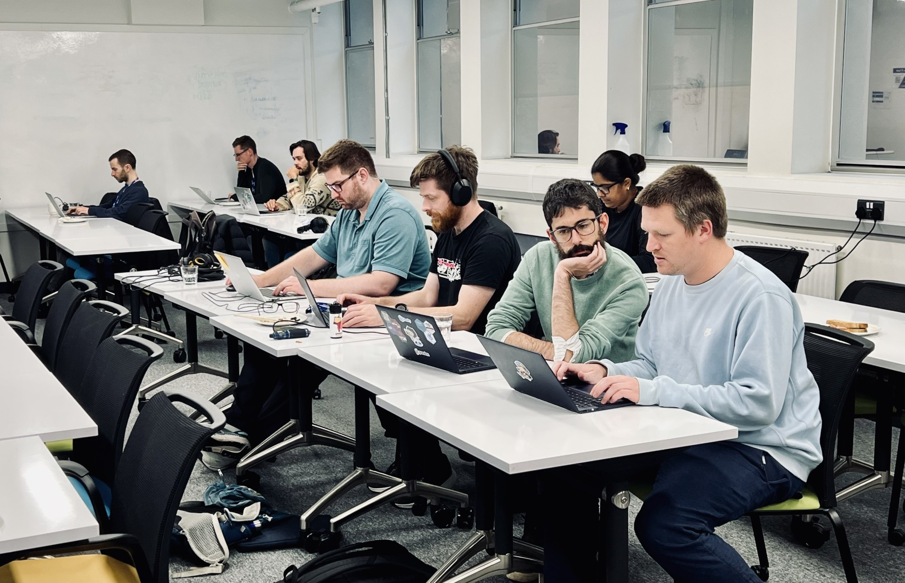

# Hacktoberfest 2024: Bring your own code

{: .no-caption style="display:block;margin:auto;width:69%" }

[Hacktoberfest](https://hacktoberfest.com/) is a month-long annual event that encourages people to contribute to open source throughout October. The motivation of Hacktoberfest is to celebrate all things open source, especially the people that make open source so special.

This year the central RSE team at Imperial planned two in-person events during Hacktoberfest on the 1st and the 23rd of October. The events were open to anybody interested in participating in open source software, either coding or with non-code contributions. Everybody was welcome to join the events and bring their own code along for a discussion with the central RSE team members. This included [low code and non-code contributions](https://hacktoberfest.com/participation/#low-or-non-code) - a big chunk of what surrounds good open source software has nothing to do with code!

<!-- more -->

The first event took place on the 1st of October 2024 in the Chemistry Building, in the South Kensington Campus. Most of the attendees were there in person, but a few also joined online. We tried together to work in groups when dealing with the same piece of software, but we were so much in the flow, that we forgot and ended up hacking intensely with our own thoughts. Before we realised, it was already lunch time and then the wrap-up session.

{: .no-caption style="display:block;margin:auto;width:69%" }

The second event, on the 23rd of October, took place at the Seminar and Learning Centre (SALC-10), with several participants in person related to on-going projects of the RSE Team. On this occasion, we had pizza for lunch, because what a better companion to coding than pizza?

## Projects

The following projects were pitched at the start of the event and chosen by the attendees to work on:

### Clockify TUI – Alex Dewar​

[Clockify](https://clockify.me/) is a free time tracker and timesheet app, which can be accessed via the web or graphical apps for various platforms. We use it within the RSE team to track the time spent on different projects. [Clockify TUI](https://github.com/alexdewar/clockify-tui/) is a project which aims to provide a simple interactive terminal app to provide basic functionality such as starting/stopping the timer and viewing the most recent time entries. It will do this with the help of [a Python package](https://pypi.org/project/clockify-api-client/) which provides an interface to the [Clockify REST API](https://docs.clockify.me/). The terminal UI will be built using the cross-platform [`blessed`](https://pypi.org/project/blessed/) library.

As the project is still in very early development, the goals for Hacktoberfest were to produce a minimal working prototype, i.e. something which can send/retrieve basic data to the Clockify API and display it within the interactive terminal UI.
​

### WSIMOD – Barnaby Dobson​

The terrestrial water cycle is a highly interconnected system where the movement of water is affected by physical and human processes. Thus, environmental models may become inaccurate if they do not provide a complete picture of the water cycle, missing out on unexpected opportunities and omitting impacts that arise from complex interactions.

[WSIMOD](https://imperialcollegelondon.github.io/wsi/) is a modelling framework written in Python to integrate these different processes. It provides a message passing interface to enable different subsystem models to communicate water flux and water quality information between one other, as well as self-contained representations of the key parts of the water cycle (rivers, reservoirs, urban and rural hydrological catchments, treatment plants, and pipe networks).

The main work done for Hacktoberfest was related to [refactoring some bits of code](https://github.com/ImperialCollegeLondon/wsi/pull/106) to improve its modularity.

### SWMManywhere – Barnaby Dobson​

[SWMManywhere](https://imperialcollegelondon.github.io/SWMManywhere/) is a tool to synthesise urban drainage network models (UDMs) using publicly available data such as street networks, digital elevation models (DEMs), and building footprints, across the globe. It also provides tools for generating SWMM input files and performing simulations for the synthesised UDMs.

One issue was tackled during the event by our colleague Tom Bland, [setting up Codecov in the repo](https://github.com/ImperialCollegeLondon/SWMManywhere/pull/304), but it brought up a lot of trouble due to a bug in Codecov, apparently. The lessons learnt have been used for other projects, so it was still time well spent!

Another job was tackled by our colleague James Turner, where the map data downloader was enhanced to [only download a box-bounded subset of buildings data](https://github.com/ImperialCollegeLondon/SWMManywhere/pull/334), rather than all data, significantly reducing the final download size. This involved interfacing with the [Overture Maps Foundation](https://overturemaps.org/)'s public API to filter and download the map data.

### PyCSVY – Diego Alonso Alvarez​

[CSVY](https://github.com/ImperialCollegeLondon/pycsvy) is a small Python package to handle CSV files in which the metadata in the header
is formatted in YAML. It supports reading/writing tabular data contained in numpy
arrays, pandas DataFrames, and nested lists, as well as metadata using a standard python
dictionary. Ultimately, it aims to incorporate information about the [CSV
dialect](https://specs.frictionlessdata.io/csv-dialect/) used and a [Table
Schema](https://specs.frictionlessdata.io/table-schema/) specifying the contents of each
column to aid the reading and interpretation of the data.

There was a lot of activity in this project, which included:

- [Adding support for polars Dataframes](https://github.com/ImperialCollegeLondon/pycsvy/pull/94)
- Give the [first steps to support CSV Dialects](https://github.com/ImperialCollegeLondon/pycsvy/pull/93)
- [Modernising the linters and code formatters](https://github.com/ImperialCollegeLondon/pycsvy/pull/95), using `ruff`
- Improving the [continuous integration workflows](https://github.com/ImperialCollegeLondon/pycsvy/pull/95) and [the use of Dependabot](https://github.com/ImperialCollegeLondon/pycsvy/pull/89)
- [Setting UTF-8 as default encoding when reading and writing](https://github.com/ImperialCollegeLondon/pycsvy/pull/124)
- [A Validator's registry](https://github.com/ImperialCollegeLondon/pycsvy/pull/123) was also added, setting the basis for data validation in the future.

Further work was started during Hacktoberfest and will hopefully see the light soon!

### repositoryr – Saranjeet Kaur Bhogal

​[repositoryr](https://imperialcollegelondon.github.io/repositoryr/) is a step by step guide for creating an R package repository. The corresponding [repository](https://github.com/ImperialCollegeLondon/repositoryr) itself is structured as an R package that is installable from GitHub. It showcases how `devtools` can be used in RStudio for package development. It also provides steps to create a website for an R package using `pkgdown`.

The activities completed in this project as a part of Hacktoberfest include:

- [Describing the use of `devtools` in package development](https://github.com/ImperialCollegeLondon/repositoryr/pull/5)
- [Adding steps to create a website for the package](https://github.com/ImperialCollegeLondon/repositoryr/pull/6)
​- Included steps to [update the `DESCRIPTION` file](https://github.com/ImperialCollegeLondon/repositoryr/pull/11)
- Steps to [set up `.R` files and unit testing files](https://github.com/ImperialCollegeLondon/repositoryr/pull/12)
- Added a section on [how to build the README](https://github.com/ImperialCollegeLondon/repositoryr/pull/13)

### RSE Competencies Toolkit – Adrian D'Alessandro​

[The RSE Competencies Toolkit](https://rsetoolkit.github.io/rse-competencies-toolkit/) is a community resource to support RSEs (Research Software Engineers) in tracking and managing their professional development. It is in the very early days of development for the interactive web app. This hack day was used to kick start the development of the tool.

The activities are captured in [this umbrella issue on the Django project setup](https://github.com/AdrianDAlessandro/rse-competencies-toolkit-webapp/issues/6).

### CrystalBot and CryptoTrade - Benjamin J Scharpf

[CrystalBot](https://github.com/HarmonicReflux/crystalbot) is a formerly active Crypto trading app written in `TypeScript` and based off a mathematics paper named [Optimal market making](https://github.com/HarmonicReflux/crystalbot/tree/main/literature), published
by Olivier Gueant from 2017. The aim of the efforts conducted during Hacktoberfest 2024 was to introduce the participating audience to the project
and to find potential contributors, as well  as making an attempt to understand the code base and translating it to Python or C++.

During the second day of Hacktoberfest, the Benjamin worked on building a GitHub repository publishing a project he worked on in his own time. It is named [CryptoTrade](https://github.com/HarmonicReflux/CryptoTrade) and, to some extent, can be seen as the little brother
of _CrystalBot_. It is written in `C++` and the result of a [Coursera course on Object Oriented Programming in C++](https://www.coursera.org/specializations/object-oriented-programming-s12n)
created by [Matthew Yee-King](https://www.gold.ac.uk/computing/people/m-yee-king/) from Goldsmiths University London.

While it might be rewarding to get [course certificate](https://www.coursera.org/account/accomplishments/specialization/FMA5TD0N4K7E), the more relevant
parts of the repository are the implementation of a [CSV reader in C++](https://github.com/HarmonicReflux/CryptoTrade/blob/main/src/CSVReader.cpp)
as well as a simple [Matching Engine in C++](https://github.com/HarmonicReflux/CryptoTrade/blob/main/src/OrderBook.cpp).
Especially matching engines are a highly specialised field, often non-disclosed, and software engineers interested in improving the current state
are invited to take a look at popular resources like
[An introduction to matching engines](https://databento.com/blog/introduction-matching-engines#:~:text=A%20matching%20engine%20is%20usually,and%20load%20balancers%20between%20them.)
, [Matching Engine Explained](https://finchtrade.com/blog/matching-engine-explained-the-backbone-of-modern-trading#1), and a more thorough article about
[an open-source low-latency high-throughput matching engine](https://arxiv.org/pdf/2102.10925).

### Mini-tutorial on using `pipx` and `pyenv` - Benjamin J Scharpf

Often, during intense coding sessions such as Hacktoberfest, developers discover issues whose solutions are worth being documented and shared.
Such an example may be [making `pipx` use a Python version specified by `pyenv`](https://www.linkedin.com/feed/update/urn:li:activity:7255105410720837632/)
The "how-to-tutorial" is demonstrated using the Linux `Z Shell`, but the same commands are effective in the perhaps still more commonly used `bash` shell.
While the documentation of the issue and its solution did not take consume much of Hacktoberfest, at the time of writing, the post has about 2100 impressions.
While these are not that many compared to popular posts on social media, they are still orders of magnitude higher than the audience the author could ever reach in class at university.

## Summary

The events were a nice opportunity to dive into other projects beyond our daily routine, learn how things are done in other places, as well as tools and techniques. Attendance was not brilliant and it would have been nice to be a bigger crowd but, nevertheless, it was a good experience. Now, the challenge for everyone is to keep going and finish up what they started!
