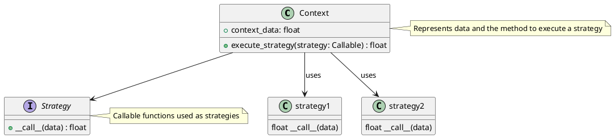
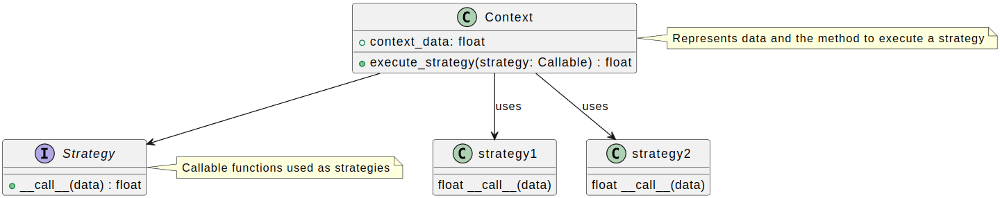
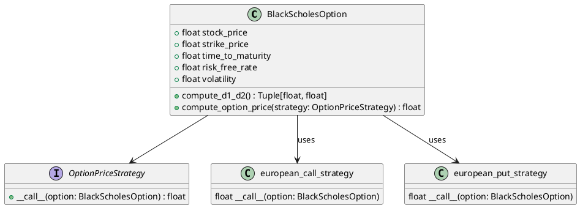
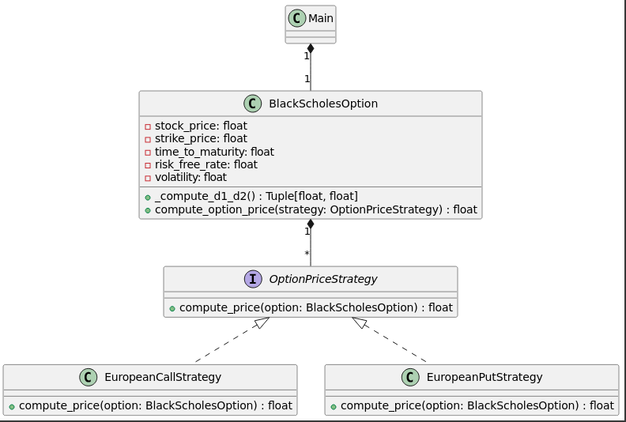

# An example of a software design pattern for European option pricing using UML diagrams

*Design Patterns* were first introduced in the seminal book
[Design Patterns: Elements of Reusable Object-Oriented Software](https://www.amazon.com/Design-Patterns-Elements-Reusable-Object-Oriented/dp/0201633612)
by Erich Gamma, Richard Helm, Ralph Johnson, and John Vlissides, who are collectively known as the "Gang of Four" [[Gamma et al. (1994)]](#gamma1994).
This book forms the foundation of Object-Oriented design theory and practice. A *Design Pattern* is a general, reusable solution to a commonly
occurring problem in software design. These patterns are based on the philosophy of finding standard solutions to common problems in software engineering challenges.

Just as there are standard designs for car engines, like the four-stroke engine, design patterns serve a similar purpose in software.
Each pattern provides a tried-and-true solution to a specific problem.
Some of these patterns focus on object creation, others on structuring systems of objects, and still others on how objects should communicate.

<!-- more -->

The book referenced above is approximately 30 years old, and much has changed in the computing world since its publication,
including the evolution of programming languages and development methodologies.
The "move fast and fail fast" mentality of start-ups, and the approach often seen in quantitative analysis within finance, where the focus
is primarily on solving the immediate problem rather than on the design of the program, are prime examples of this shift.
Many Jupyter notebooks, written in isolation, exemplify this mentality, where data scientists are often stuck on the
"make it work" mantra, without progressing to "make it right", and ultimately to "make it fast".

This is not meant as a criticism, as the "make it work" step often involves significant reworking, rewriting, or even re-manufacturing of entire code blocks.
However, as systems mature, this approach can lead to technical debt, resulting in code that is confusingly difficult to maintain.

This blog post illustrates how the concept of a *Design Pattern* from the early '90s can be translated to modern-day Python. Given the 23 patterns introduced
in the referenced book are split up into four *Creational Patterns*, seven *Structural Patterns*, and 11 *Behavioural Patterns*, we limit our efforts to one specific pattern,
namely the *Strategy Pattern* which belongs to the class of Behavioural Patterns.

What are the ingredients do we need to be aware of to get started then?

1. As the patterns themselves are abstract in nature, we introduce the reader to their architecture via UML diagrams. UML stands for *Unified Modelling Language* and visualises the way and links through which systems interact with each other. This makes it particularly useful to visualise software. You might say - we have barely started and yet are off to a detour? Not really - at least not without ulterior motive. Having fundamental knowledge about UML diagrams will make it easier to facilitate the transition from the anatomy of the Design Pattern to the actual code, as the UML diagram serves as the blueprint we use to translate the pattern to code.
2. The definition of the Design Pattern we wish to make use of.
3. Some background of the application we apply the Design Pattern to. The author chose a common topic in finance, namely option pricing, specifically, European put and call options. Do not worry yet. We will introduce and explain the necessary vocabulary as well as the equations we implement as we go along.
4. The actual implementation of pricing European options making use of the strategy pattern.

Let us now follow that plan and get going.

## Unified Modelling Language (UML)

In software engineering, it is often important to consider how to define
objects and their properties as well as functions that interact with data, at a conceptual level.
This is much like an architect creating a blueprint before the actual construction of the building begins.
One of the tools available to us for this purpose is the *Unified Modelling Language (UML)*.
More specifically, UML is a standardised modelling language to specify, visualise, construct,
and document the components of software systems.
While it is not a programming language per se, it serves to help software developers
and architects plan and design their software.
As part of ingredient one, we briefly outline the nuts and bolts of UML here, but for the interested reader, refer
to [[Booch et al. (2005)]](#booch2005) for an elaborate discussion.

UML includes a set of graphic notation techniques to create visual representations of software systems
and is meant to simplify communication, making it easier for both development teams and external stakeholders
to understand the software design. Moreover, it incentivises forward planning of a structured API,
rather than having to retroactively standardise a poorly designed API in the future.
This is particularly helpful in a collaborative setting.

Moreover, UML diagrams play an important role in the documentation process, offering various types
of diagrams tailored to different aspects of the software.
For instance, use case diagrams are used for requirements gathering, class diagrams depict
static structure, and sequence diagrams detail interactions within the system.
UML also helps break down complex systems into manageable components that can be designed, analysed, and implemented independently.
Another key strength of UML is its platform independence, allowing the same modelling language
to be used across various platforms, ensuring consistency and flexibility in software design.

### Types of UML diagrams

UML includes several types of diagrams, each serving different purposes:

- Structural diagrams (e.g., class diagrams, object diagrams): Focus on the static aspects of the system.
- Behavioural diagrams (e.g., use case diagrams, activity diagrams): Focus on dynamic aspects.
- Interaction diagrams (part of behavioural diagrams, e.g., sequence diagrams, communication diagrams): Focus specifically on the flow of control and data among the elements in the system.

Thus, UML helps developers engineer and translate their ideas into functional software, serving as a component of modern software engineering practice.

### UML within Jupyter notebooks

From within Jupyter notebooks, one can design UML diagrams using a library called *iplantuml*, that we can install via pip upon invoking `pip install iplantuml`.

```python
try:
    import iplantuml
except ImportError:
    !pip install iplantuml
    import iplantuml
```

Let us now proceed to ingredient two - the definition of the Design Pattern we wish to make use of later.

## The *Strategy Design Pattern*

The *Strategy Pattern* is used to define a family of algorithms, encapsulate each one, and make
them interchangeable. This pattern allows an algorithm to vary independently of the
clients that use it.

The concept of the Strategy Pattern can be outlined as follows:

- Context: This is the class that uses a Strategy. The Context is configured with a *ConcreteStrategy* object, which it uses to perform a specific algorithm.
- Strategy interface: This defines a common interface for all supported algorithms. The context uses this interface to call the algorithm defined by a *ConcreteStrategy*.
- *ConcreteStrategy*: These are the classes that implement the Strategy interface, each providing a specific implementation of the algorithm.

We can code up the UML diagram of the Strategy pattern in a code block of a Jupyter notebook using *plantuml* as follows.





We can identify the following relations in the UML diagram:

- Context: Represented by a rectangular box with the class name at the top, containing attributes and methods. This class is the main entity that holds data and executes different strategies dynamically.
- *strategy1* and *strategy2*: Each represents a concrete function that implements a specific strategy. These functions act as strategies and are shown in boxes to represent that they provide the actual implementations.
- Interface (Strategy): Represented by a rectangular box labelled with interface at the top. This symbol signifies that Strategy defines a conceptual contract (or "interface") in terms of method signature rather than implementation.
Here, it is treated as an abstract *Callable* that other functions (*strategy1* and *strategy2*) must conform to.

Note, while [[Gamma et al. (1994)]](#gamma1994) use an Object-Oriented approach to implement the strategies, we find it more straightforward and easier-to-read-code to take a functional approach here.

We can now use our blueprint and engineer a computer program that implements the abstract pattern. We will, however, not be satisfied by coding up the pattern itself and upon success, print out a message called displaying "pattern created".
Instead, we opt to illustrate its relevance in practice. This leads us to ingredient three: Some detail on financial terms used in academia and practice, that help us to describe the problem we chose to solve.

## Background and finance jargon for option pricing

As an example we pick pricing a European call and put option using the *Black-Scholes-Merton* equation
which is a common task in pricing vanilla derivatives. *Vanilla* hereby is a term that stands for a standard
contract with no special features or complex conditions. As an aside, it is mentioned
that the *Black-Scholes-Merton* is often referred to simply as *Black-Scholes* equation. The
terms are used synonymously and refer to the same stochastic differential equation as we soon shall see.

Right there, a few terms popped up that may need further elaboration. An *option* is a financial contract that
gives its holder the right, but not the obligation to buy or sell a financial object such as a stock, a commodity, a currency,
or any other *underlying* for a defined, pre-agreed price. An option enabling to buy something at a later date
is named a *call option*, whereas an option enabling to sell something at a later date at a pre-agreed
price is called a *put option*.

The entity buying the option is called the holder of the option. As no buy can be facilitated
without a sell, and vice versa, we need an entity, say an institution, or any other
counterparty issuing the option. This is called the writer of the option.

Finally, one can distinguish when the option can be exercised against a counterparty.
If this is the case only at the date of expiry, such an option is called *European option*.
There are many other variations, say when an option can be exercised
at any time upon purchase or in case of other pre-agreed particularities, but let us not bother with
these cases in this article.

What then makes the *Black-Scholes* equation so important you may ask?
Until the 1970s, there did not exist a published rigorous mathematical framework to determine the fair price of
a European option and prices were determined purely by supply and demand in the options market.
In honour of the mathematician and economist who were first attributed to find such a mathematical framework,
their pricing equation is called the *Black-Scholes* equation.
It is a stochastic differential equation and given by:

$$
\frac{\partial V}{\partial t} + \frac{1}{2} \sigma^2 S^2 \frac{\partial^2 V}{\partial S^2} + r S \frac{\partial V}{\partial S} - r V = 0
$$

where:

- \( V \) is the price of a general European option contract (of type put or call).
- \( t \) is time.
- \( S \) is the price of the underlying asset for example a stock in case of a stock option.
- \( \sigma \) is the volatility of the underlying asset. It describes the magnitude the price of the asset fluctuates.
- \( r \) is the risk-free interest rate with continuous compounding (c.c.).

For those interested in diving into the detailed mathematics, of option pricing in general and
*Brownian Motion* in particular, there exists a great text by [[Shreve (2004)]](#shreve2004).
Brownian Motion is an approximate model of the evolution of stock prices.
Without proof, the following expressions for the price of a European put and call option
solve the Black-Scholes equation:

### European call option price

$$
c = S_0 N(d_1) - K e^{-rT} N(d_2)
$$

### European put option price

$$
p = K e^{-rT} N(-d_2) - S_0 N(-d_1)
$$

where:

$$
d_1 = \frac{\ln(S_0 / K) + (r + \sigma^2 / 2)T}{\sigma \sqrt{T}}
$$

$$
d_2 = d_1 - \sigma \sqrt{T}
$$

Thereby:

- \( c \) is the price of the call option.
- \( p \) is the price of the put option.
- \( S_0 \) is the current price of the underlying asset.
- \( K \) is the strike price of the option.
- \( r \) is the risk-free interest rate.
- \( T \) is the time to maturity.
- \( \sigma \) is the volatility of the underlying asset.
- \( N(\cdot) \) is the cumulative distribution function of the standard normal distribution.

Having made good progress, we are finally in a position to work on ingredient four, namely, to implement these pricing equations in a Python program using the *Strategy Pattern*.

## Implementation of the *Strategy Pattern* for European option pricing

We make use of the definition of the *Strategy Design Pattern* discussed above, and translate it to the problem at hand. We first modify the UML diagram to lay out the architecture and then follow-up
with a code implementation.

### UML diagram





As you can see, the concrete strategies that the *Strategy Pattern* demands us to implement are the pricing equations for both the European put and European call option.
The dataclass `BlackScholesOption()` only delivers a promise to implement these pricing equations, however the concrete strategies are the ones that deliver them. We now have a clear plan of how our program
should look, we can start coding it up. Planning software like this may be very different from just coding spontaneously with less preparation, however we now know exactly what parts the software
needs to consist of and how they interact.

### Python code

Translating the UML diagram to Python code then looks as follows:

```python
from dataclasses import dataclass
import numpy as np
from scipy.stats import norm
from typing import Callable, Tuple


OptionPriceStrategy = Callable[['BlackScholesOption'], float]  # define the OptionPriceStrategy type as a Callable that accepts a BlackScholesOption and returns a float


def european_call_strategy(option: 'BlackScholesOption') -> float:  # implement the European call option pricing strategy as a function
    d1, d2 = option.compute_d1_d2()
    price = (option.stock_price * norm.cdf(d1) -
             option.strike_price * np.exp(-option.risk_free_rate * option.time_to_maturity) * norm.cdf(d2))
    return price

def european_put_strategy(option: 'BlackScholesOption') -> float:  # implement the European put option pricing strategy as a function
    d1, d2 = option.compute_d1_d2()
    price = (option.strike_price * np.exp(-option.risk_free_rate * option.time_to_maturity) * norm.cdf(-d2) -
             option.stock_price * norm.cdf(-d1))
    return price


@dataclass  # define the Black-Scholes option class using dataclass
class BlackScholesOption:
    stock_price: float
    strike_price: float
    time_to_maturity: float
    risk_free_rate: float
    volatility: float


    def compute_d1_d2(self) -> Tuple[float, float]:  # method to compute d1 and d2 for Black-Scholes formula
        d1 = (np.log(self.stock_price / self.strike_price) +
              (self.risk_free_rate + 0.5 * self.volatility ** 2) * self.time_to_maturity) / (self.volatility * np.sqrt(self.time_to_maturity))
        d2 = d1 - self.volatility * np.sqrt(self.time_to_maturity)
        return d1, d2


    def compute_option_price(self, strategy: OptionPriceStrategy) -> float:  # method to compute the option price using a given pricing strategy
        return strategy(self)


def main() -> None:

    option = BlackScholesOption(  # create a Black-Scholes option with given parameters
        stock_price=100,
        strike_price=100,
        time_to_maturity=1,
        risk_free_rate=0.05,
        volatility=0.2
    )

    call_price: float = option.compute_option_price(european_call_strategy)  # compute and print the call option price using the call strategy
    print(f"call price: {call_price:.2f} [monetary units].")

    put_price: float = option.compute_option_price(european_put_strategy)  # compute and print the put option price using the put strategy
    print(f"put price: {put_price:.2f} [monetary units].")

if __name__ == "__main__":
    main()
```

In the currency of the option contract, under the Black-Scholes model, the price for a European call and put option, are hence:

```txt
call price: 10.45 [monetary units].
put price: 5.57 [monetary units].
```

Analysing the code, of particular relevance is the separation of concerns:  `european_call_strategy()` knows nothing about `european_put_strategy()` and vice versa.
It is thus straight-forward to maintain and extend one part of the *concrete strategy* without affecting the other. This is a useful property if multiple team members simultaneously work on the same code base.
These could, for example, be mathematicians that extend the set of concrete strategies, say using a numeric approach, or other software engineers and traders who take the output of a strategy as input for
further analysis or concrete actions in the options market. Moreover, and perhaps more relevant in immediate practice, is that merge conflicts are avoided and code reviews are easier to facilitate.
With these encouraging results, the programming part of the tutorial is concluded.

However, if you are willing to read still a little more, we can turn to the question of how one can assess whether the computed option prices are fair.
One possibility is to utilise the *put-call parity* for which we already have all parameters in the dataclass `BlackScholesOption()`. A quick overview of the concept is provided next.

## Yet more financial theory: Are the European options priced fairly?

As we know the duration of the option, we can discount its strike price to obtain its present value (PV). We can then construct two portfolios:
One portfolio consisting of the price of the call option plus its discounted strike price, and secondly, a portfolio consisting of the price of the put option plus the price of the underlying asset.

If the options were priced fairly, these two portfolios evaluate to the same price. If not, there is an arbitrage opportunity. Arbitrage means to execute a risk-less trade with
positive payoff realising and instant profit. Applied to the case at hand, this manifests itself by buying the undervalued portfolio and selling the overvalued portfolio, realising a profit
that evaluates to the absolute difference of both.

!!! note "put-call-parity"
     Note, the put-call-parity assumes that both, the European put option, and the European call option, feature the same strike price.

In a formula, the *put-call parity* translates to:

\[ c + K e^{-r T} = p + S \]

Where:

- \( c \) is the price of the call option.
- \( p \) is the price of the put option.
- \( S \) is the current price of the underlying asset.
- \( K \) is the strike price of the option.
- \( r \) is the risk-free interest rate.
- \( T \) is the time to maturity.
- \( K e^{-r T} \) is the present value of the strike price, discounted by the risk-free rate over the time to maturity.

We can translate this to Python like so:

```python
call_price = option.compute_option_price(european_call_strategy)  # compute and print the call option price using the call strategy
put_price = option.compute_option_price(european_put_strategy)  # compute and print the put option price using the put strategy

# verify if the put-call parity holds:
present_value_strike = option.strike_price * np.exp(-option.risk_free_rate * option.time_to_maturity)  # present value of strike price

# implement the left and right side of the put-call parity equation
left_side = call_price + present_value_strike
right_side = put_price + option.stock_price

print(f"call price: {call_price:.2f} [monetary units].")
print(f"put price: {put_price:.2f} [monetary units].")
print(f"present value of strike price: {present_value_strike:.2f} [monetary units].")
print(f"left side (C + PV(K)): {left_side:.2f} [monetary units].")
print(f"right side (P + S): {right_side:.2f} [monetary units].")
print(f"put-call parity holds: {np.isclose(left_side, right_side)}")
```

And obtain the following output:

```txt
call price: 10.45 [monetary units].
put price: 5.57 [monetary units].
present value of strike price: 95.12 [monetary units].
left side (C + PV(K)): 105.57 [monetary units].
right side (P + S): 105.57 [monetary units].
put-call parity holds: True
```

As both the left and right sides of the equation of the put-call parity are equal, we can confidently say that the option prices computed by our software are accurate, reflecting the efficiency of the
market they trade in. Given the analytic example, this is not surprising and the interested reader is invited to track option prices on a live exchange and watch for any fleeting arbitrage opportunities
that may arise. This exercise is similar to spotting cash lying in the street and observing how quickly it is being picked up.
To the author's experience, while London's streets may be littered with plenty that does not belong, spare cash is rarely part of the scenery.

## Conclusion

In this article, we introduced the concept of *Design Patterns* and demonstrated how to implement the *Strategy Pattern* using the functional programming paradigm that Python supports.
To illustrate the practical use of this design pattern, we provided a concrete example from finance, namely pricing European put and call options.
We created a dataclass that stores the data we need our *concrete strategies* to take as input.

By applying the *Strategy Pattern*, we achieved a clear separation of concerns, resulting in loosely coupled and maintainable code. These are key characteristics of high-quality software
engineering, ensuring that the code is understandable, extensible, and maintainable. Also, in an addendum, we made use of the computed output prices and utilised the *put-call parity* to confirm the
options are priced fairly.

The reader is encouraged to explore the original publication on *Design Patterns* for to see what other patterns exist and what problems they solve.
As the design patterns themselves are generally valid, feel free to implement them in a programming language of your choice. Finally, if you are interested in a real-world data
science application, you could plug into an options exchange and observe whether you can spot any arbitrage opportunities, granted this will be an ambitious project.

## References

<!-- spell-check-ignore -->
<!-- markdownlint-disable MD033 -->
<div id="gamma1994"></div> [Gamma et al. (1994)]: Gamma, E., Helm, R., Johnson, R., & Vlissides, J. *Design patterns: Elements of reusable object-oriented software.* Addison-Wesley, 1994.
<div id="shreve2004"></div> [Shreve (2004)]: Shreve, S. *Stochastic Calculus for Finance II: Continuous-Time Models.* Springer Finance, 2004.
<div id="booch2005"></div> [Booch et al. (2005)]: Booch, G., Rumbaugh, J., and Jacobson, I. *The Unified Modeling Language User Guide.* 2nd ed. Addison-Wesley, 2005.
<!-- markdownlint-disable MD033 -->
<!-- end-spell-check-ignore -->

## Additional material

The author of this article can recommend the YouTube channel of computer scientist [Douglas Schmidt](https://news.vanderbilt.edu/experts/expertprofile/?expert_username=douglas.schmidt)
that features recorded lectures. In particular the
[YouTube playlist about Design Patterns in C++](https://www.youtube.com/watch?v=o1SrQ3cJFfg&list=PLZ9NgFYEMxp6p4oC9bP3PZdZ-FAPDeavB&index=2)
will be useful for an audience interested in software engineering with said programming language.
