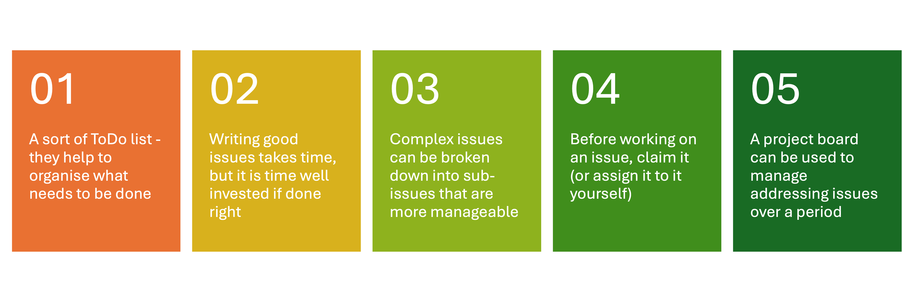
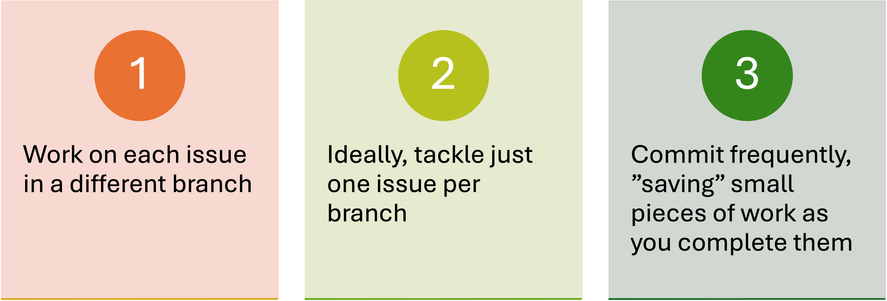
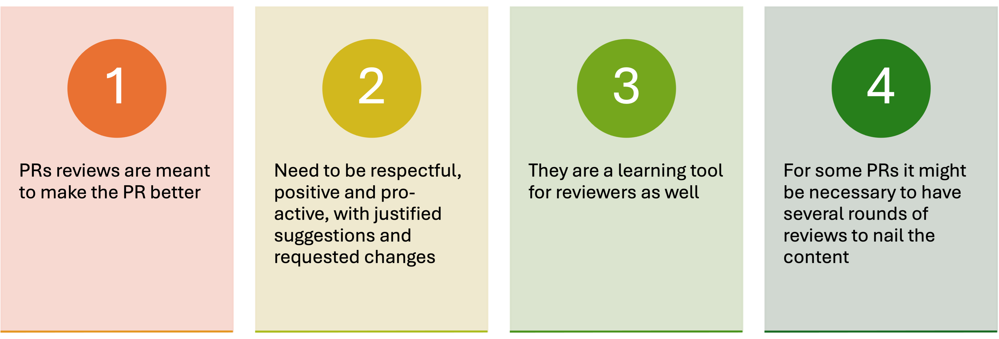
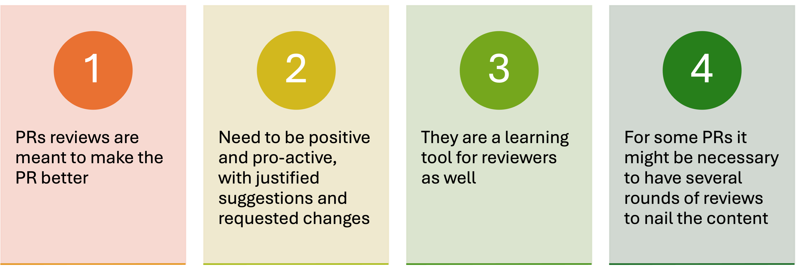

# Git and GitHub for efficient project management and collaboration: a mini-tutorial

Version control is an essential part of software development good practices, specially when combined with an online repository that enables easy collaboration with other people. One of the most common tool combination is using `git` for version control and `GitHub` as the online repository.

Despite being more common nowadays, and despite the long term benefits it brings to the table, many software development done in a research environments like universities does not use version control, maybe because researchers do not know about it or because they do not know how to do it right, seeing it more as a burden. This mini-tutorial on Git and, specially, GitHub aims to help users with those first steps and point them in the right direction to learn more about the topic.

<!-- more -->

## Resources and courses

This blog post is not a course but just a minimalistic how-to to use `git` and `GitHub` effectively, specially when collaborating with others. We strongly recommend checking more full-feature training materials on the topic like the [Software Carpentry](https://software-carpentry.org/) or [Code Refinery](https://coderefinery.org/lessons/) courses or the courses created for the [Early Career Researcher Institute (ECRI)](https://www.imperial.ac.uk/students/academic-support/graduate-school/professional-development/doctoral-students/research-computing-data-science/courses/) by the [Research Software Engineering team at Imperial](https://www.imperial.ac.uk/admin-services/ict/self-service/research-support/rcs/service-offering/research-software-engineering/):

- [Introduction to using Git and GitHub for software development](https://imperialcollegelondon.github.io/introductory_grad_school_git_course/)
- [Further Git and GitHub for Effective Collaboration](https://imperialcollegelondon.github.io/intermediate_grad_school_git_course/)

We will be pointing to the relevant parts of these two courses as well as to other resources in the sections below to help users to expand their knowledge.

## GitHub Issues and the Project board

The starting point for a good collaborative development process is to have well crafted **issues** helping to identify what needs doing and what sort of work it involves. Is it about a new feature? Is it about a bug? Is it about a whole new set of interconnected functionality? When combined with a **GitHub Project board**, this will help to schedule the work to be done and coordinate efforts among different developers. Even if you work solo, in your own code or thesis, this helps you to prioritise your work and focus on what really matters at any given time.

You can read more about [Using GitHub issues](https://imperialcollegelondon.github.io/introductory_grad_school_git_course/l3-01-issues/index.html) in our introductory Git and GitHub course.

{: .no-caption style="display:block;margin:auto;width:86%" }

- **Issues are a sort of ToDo list - they help to organise what needs to be done**. Use labels to sort the issues in categories and write meaningful issue titles to help the reader quickly figuring out what they are about.
- **Writing good issues takes time, but it is time well invested if done right**. Writing an issue is not just _writing_ but also reflecting on what needs to be written, which means reflecting on the problem to solve, being this fixing a bug or adding new functionality. As you might not be the one finally addressing the issue, include clear explanations and context that are understandable to others. They might not know what you know. Also, if there's a tool or solution that you think will work well to tackle that issue, do mention it.
- **Complex issues should be broken down into sub-issues that are more manageable**. This enables team members (or yourself if you work alone on the project) to work in parallel in different aspects of the code. It also leads to smaller pull requests, which are easier to review. Use [task lists](https://docs.github.com/en/get-started/writing-on-github/working-with-advanced-formatting/about-task-lists) to organise the sub-issues within large, umbrella issues.
- **Before working on an issue, claim it (or assign it to it yourself)**. This is essential in a collaborative project to make sure that no two people are working on the same issue without knowing it, which would be a wasteful duplication of efforts.
- **A project board can be used to manage addressing issues over a period of time**. Define iterations - typically 2-weeks long, but might be longer or shorter, depending on the project - and allocate the issues to them based on their priority, time available or skills of the people working on the project. Then use this board to monitor progress and take corrective actions if things are going off-track. You can read [all about GitHub Projects](https://docs.github.com/en/issues/planning-and-tracking-with-projects) in the GitHub docs.

## Branches

The strength of version control is that it permits the developer to isolate different tracks of work, which can later be merged to create a composite version that contains all changes. The mechanism to maintain those different tracks of work are called **branches**. You can learn all about branches in the [Branching and merging](https://imperialcollegelondon.github.io/intermediate_grad_school_git_course/02-branching_merging/index.html) episode of the Further Git and GitHub course.

{: .no-caption style="display:block;margin:auto;width:52%" }

- **Work on each issue in a different branch**. As issues will be, in theory, well defined and self-contained, this will help avoiding conflicts later on when merging the branch via a [pull request](#pull-requests).
- **Ideally, tackle just one issue per branch**. But if you are tackling more than one, make sure they are related with each other. Do not tackle another random issue just because you have just spotted the right part of the code - that will make future reviewing messier and more confusing.
- **Commit frequently, _saving_ small pieces of work as you complete them**. That makes it easier to identify who changed what and when. You can [use emojis](https://gitmoji.dev/) to give a visual indication of what the commit is about and make sure you write [meaningful commit messages](https://www.freecodecamp.org/news/how-to-write-better-git-commit-messages/).

## Pull Requests

{: .no-caption style="display:block;margin:auto;width:86%" }

- **Pull requests are the means to incorporate new features (or fix bugs) to the base code when collaborating**. It is therefore the gateway for code growth, so an incredibly important step.
- **They enable others to provide feedback, suggest changes and try your code**. This last bit is important since, regardless of how many continuous integration tools we put in place, in the end something that works fine in someone's computer might not work so well in other's.
- **Pull requests are a learning tool as much as a quality assurance tool**, specially after receiving feedback from the reviewers. So use them as an opportunity of growing.
- **A PR should address just one issue**. Ideally, at least. This helps to keep the contribution small constrained to specific files and sections of the code.
- **Pull requests should be small to facilitate review in a short time**, as well as incorporating any changes also in a short time. It also minimises the chances of creating conflicts with other developers.

You can read more about opening pull requests in the [Managing contributions to code](https://imperialcollegelondon.github.io/intermediate_grad_school_git_course/06-managing_contributions/index.html) episode of the Further Git and GitHub course.

## Pull request reviews

{: .no-caption style="display:block;margin:auto;width:69%" }

- **PRs reviews are meant to make the PR better**. They are a means of quality control, so reviewing them is a serious task that need proper attention from the reviewer.
- **Comments and suggestions need to be respectful, positive and pro-active, with justified suggestions and requested changes**. It should be clear what is a suggestion - and therefore optional - and what a request for a change, so the PR author can action them appropriately.
- **They are a learning tool for reviewers**, as much as for the PR authors. They can learn about new tools, commands or way of doing things.
- **For some PRs it might be necessary to have several rounds of reviews to nail the content**. This is normal, specially for big PR, but it should not take ages to have a PR merged. That is annoying for both author and reviewers. To avoid this, both authors and reviewers should pay attention to what is being requested and actioned, so nothing is forgotten, and doing so as swiftly as possible, considering their other commitments.

A nice discussion on this topic can be found in the blog post [Best Practices for Reviewing Pull Requests in GitHub](https://rewind.com/blog/best-practices-for-reviewing-pull-requests-in-github/).

## Summary

Version control and online repositories help collaborating with others when developing software, but only if some simple guidelines are followed to make this process as frictionless and effective as possible. It might take some time and dedication to make this right, and sometimes you will be tempted - we all are - to skip some of these steps. Don't. Soon, they will become a second nature and will come out naturally. Believe me: the small effort will eventually pay off!
