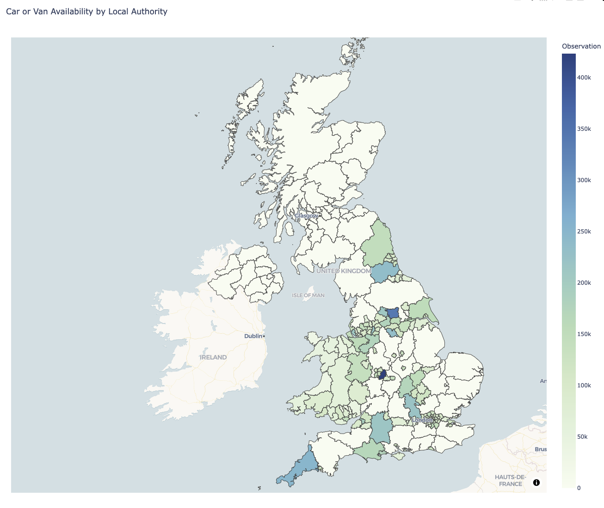
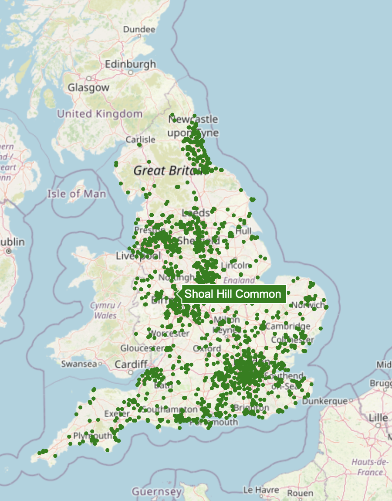
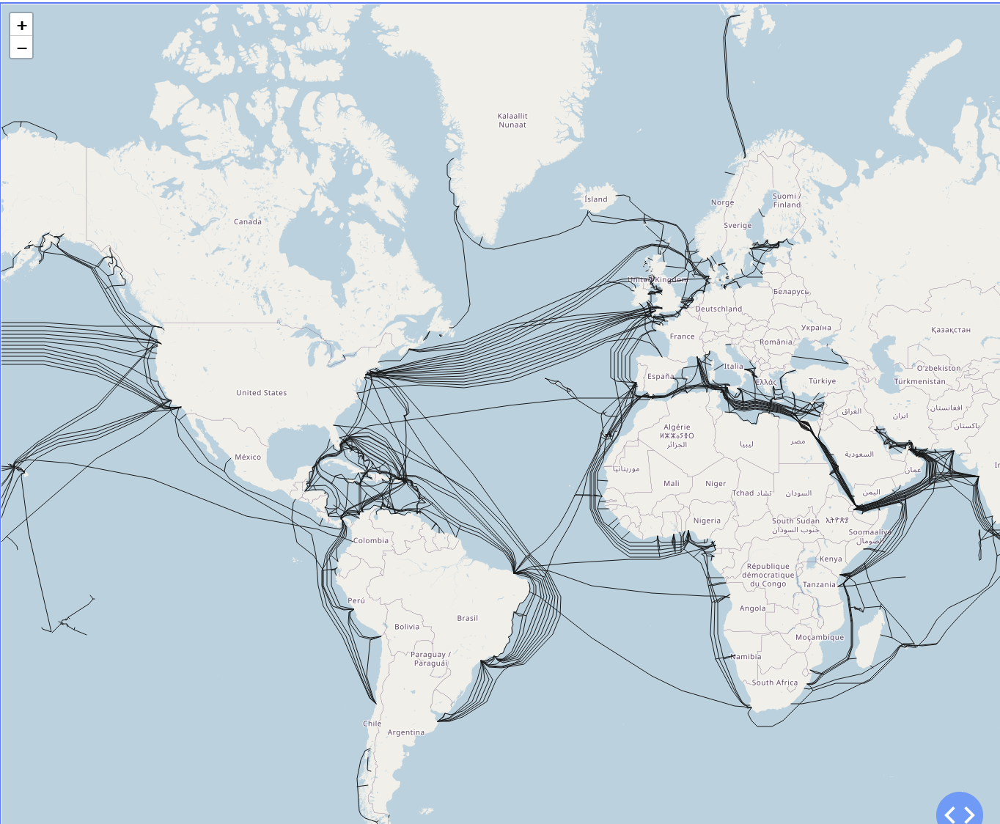
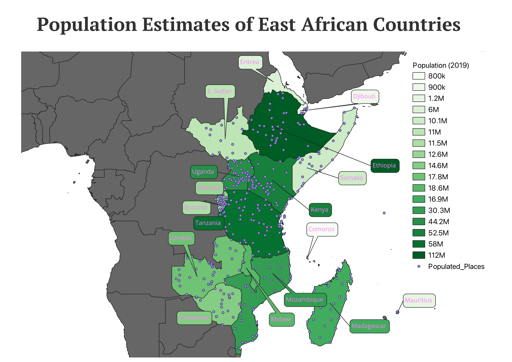

# **Mapping with Python: The 30-Day Map Challenge**

Every year, cartography enthusiasts, geographers, data visualizers, and mapmakers from all over the world gather to participate in the [30-Day Map Challenge](https://30daymapchallenge.com/). Organized by Topi Tjukanov, this prestigious event celebrates the art and science of mapmaking. Whether you’re an experienced GIS professional or just starting out, this challenge invites you to create and share a map every day, guided by a unique daily theme.

The 30-Day Map Challenge is an inclusive and open-ended initiative that encourages creativity and experimentation in mapmaking. Each day in November presents a different theme, ranging from “Points” and “Lines” to “Fantasy” and “Historical.” Participants are encouraged to interpret these prompts flexibly, using any data, tools, or artistic styles that resonate with them.
<!-- more -->
Participation is voluntary, and there’s no competition involved. Instead, this challenge is a celebration of cartographic creativity. Participants share their creations on social media platforms using the hashtag #30DayMapChallenge, creating a vibrant global gallery of diverse and imaginative maps.

This was my first year participating in the challenge. I was inspired to take on the challenge because of a recent project the RSE team worked on. They created an interactive map to display result data over a map of England. The app used Django, so I had limited options for mapping abilities. Since I wanted to directly query the Django database, I chose the library [django-plotly-dash](https://github.com/GibbsConsulting/django-plotly-dash).

For the maps showcased bellow you can find the code, file and data that was used to produce the maps my personal [repository](https://github.com/Sahil590/30daymapchallenge).

For this post, I’ll focus on four maps I created during the challenge:

## 1. Choropleth

This map type got me started on my journey, so it’s only fitting that this is the first map to showcase. For this challenge, I delved into some information about vehicle access per household gathered through the 2021 UK census and thought it would be a nice visualization to see where the most concentrated population of vehicles would be throughout the UK.

I created this map using [Plotly](https://plotly.com/examples/)

## 2. Points

{:style="display:block;margin:auto;width:50%" }

The data displayed on the map is every nature reserve and park located in the UK. The data was sourced from [data.gov](https://www.data.gov.uk/dataset/acdf4a9e-a115-41fb-bbe9-603c819aa7f7/local-nature-reserves-england).

## 3. Lines

The internet is a global network of interconnected cables that span continents, connecting people and devices worldwide. I wanted to visualize this network on a map.

To create this map, I used a GEOJSON file, a geospatial data interchange format based on JavaScript Object Notation (JSON). These files contain data that helps plot lines, points, and polygons on maps. In this case, I used it to plot lines but will also use it to plot polygons later.

The data displayed on the map was sourced from the [ArcGIS hub](https://hub.arcgis.com/maps/c12642b516bc4ee5bc9e89870ab14089/about).

## 4. New tool: QGIS

This day revolves around trying out a new tool—something entirely unfamiliar to me. For this challenge, I decided to use QGIS, a free and open-source software specifically designed for geospatial data creation, editing, analysis, visualization, and publication.

QGIS is incredibly powerful. It can handle various tasks, from thematic maps to geospatial analysis and interactive visualizations. Despite its capabilities, I had never used it before. So, I saw this as an ideal opportunity to learn something new and challenge myself.

For my initial map, I opted for simplicity and focused on visualizing the East African Region. I found a  detailed dataset from [Natrual Earth Hub](https://www.naturalearthdata.com/) that was recommended  in my tutorial for QGIS. Once I found the data I needed, setting up the map was the next challenge. Since I had no idea what I was doing, it took some time to get up to speed and produce a map I was happy with as shown in the Figure above.

When making this map, I found it much simpler getting a very detailed and prettier map that I could using any Python tools.

My initial impression of QGIS? It’s a tool that possesses immense potential but also overwhelms with an overwhelming array of options. The interface is packed with menus, toolbars, and panels, but once you start exploring, everything becomes intuitive.
