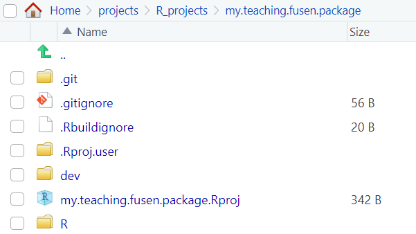
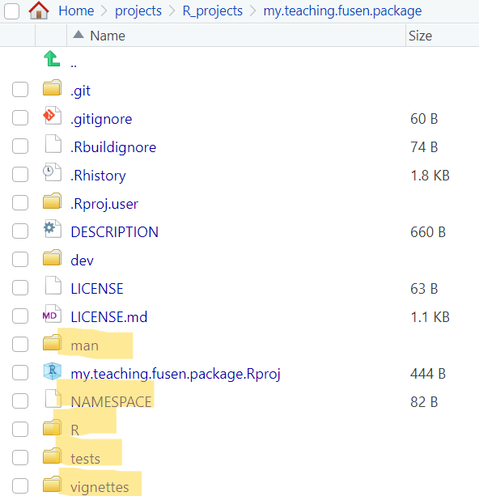

# **Building an R package using {fusen}**

{: style="display:block;margin:auto;width:69%" }

Writing your first full R package can feel overwhelming and {fusen}
can help support at this stage. "Fusen" is a type of
[Japanese origami](https://en.wikipedia.org/wiki/Kamif%C5%ABsen) in which
a flat piece of paper, when folded in a specific way and inflated, turns
into a nice paper box/balloon. Similarly, the {fusen} package inflates a
flat `.Rmd` template (which is filled in a specific way) and returns a
nice package. In this blog post, I am sharing my experience of
exploring {fusen} for the first time.
<!-- more -->

## Pre-requisites

- [RStudio installed](https://posit.co/download/rstudio-desktop/)
- [Connect RStudio to Git and GitHub](https://happygitwithr.com/rstudio-git-github.html) (_Optional, but recommended_)

## Installation and initial setup

The CRAN released version of {fusen} can be installed using:

``` r
install.packages("fusen")
```

Then we will have to create a new new project in RStudio by following:
`File > New Project > New directory > Package using {fusen}`.
This will open a `Create Package using {fusen}` wizard.
Specify the directory name and choose a {fusen} template to work with.
If you want to see how {fusen} works then select the `teaching` template
(recommended when using for the first time), else select the `full` template.
You can also provide a name for the flat file that is to be generated.
Check `Create a git repository`, `Open in new session` and
finally click on `Create Project` to create the initial structure.

## Convert a `.Rmd` file into a package

Following the installation and initial setup mentioned above
(Select the `teaching` template and default name (`first`) for the flat filename.
For the directory name, I am using `my.teaching.fusen.package`)
will open a new RStudio session with an initial structure as seen in the image below:

{: style="display:block;margin:auto;width:69%" }

Navigate to `dev/flat_first.Rmd` flat file and observe the different chunks present in it.
The chunks in the flat file help to set up your package:

- `description`: In this chunk, you will add metadata about your package (for example, package author, package license, etc.).
- `development`: This chunk can be used to write code for development purposes (we will not be using this for now).
- `function`: In this chunk, you will write code for a function in your package.
- `examples`: Here you would add examples of using the function which will become a part of the
`@examples` field in the corresponding vignette.
- `tests`: In this chunk, you can add unit tests for your function.

Add the appropriate information (title, description, author(s), email(s), license) in the `description` chunk and run it. It will generate the `DESCRIPTION` and `LICENSE` files for your package.

{: style="display:block;margin:auto;width:69%" }

There is a default `function` chunk, named `add_one` (along with its `examples` and `tests` chunk) present in the flat file. This flat file has the minimal structure required to be transformed into a package using the function `fusen::inflate()`:

``` r
fusen::inflate(
  flat_file = "dev/flat_first.Rmd",
  vignette_name = "Get started",
  check = TRUE
)
```

After running the above function, if you explore the `Files` pane on RStudio, you will notice that it looks very similar to a package structure. Notice the new directories and files that have been generated:

- `R` directory: It has the `add_one.R` function file, which is generated from `function-add_one` chunk of the flat file.
- `man` directory: It has the `add_one.Rd` file generated from the `roxygen2` comments in the `function-add_one` chunk.
- `tests` directory: It has the `testthat/test-add_one.R` generated by the `tests-add_one` chunk of the the flat file.
- `vignettes` directory: It has the `get-started.Rmd` file which is generated by the `fusen::inflate()` command.
- `NAMESPACE` file: It exports the `add_one` function (provided the `@export` field is mentioned in the `roxygen2` comments in the `function-add_one` chunk of the flat file).

{: style="display:block;margin:auto;width:69%" }

At this stage, we have a proper R package structure - if you want to you can [clean up any fusen related files and tags](#clean-fusen-related-files-and-tags) from it and can also [publish it on GitHub](#share-package-on-github)!

You can also add new family of functions to your package using new flat template files. I will add two more functions (`squared` and `is_even`) using:

``` r
fusen::add_flat_template(
  template = "additional",
  dev_dir = "dev",
  flat_name = "squared", # and later on replace this with "is_even"
)
```

This will create a new flat file template named `dev/flat_squared.Rmd` (and `dev/flat_is_even.Rmd` when the corresponding `flat_name` is used) with the various (empty) chunks that can be populated. The chunks that I used for the respective flat files are given below:

<!-- markdownlint-disable-next-line MD033 -->
<details>
<!-- markdownlint-disable-next-line MD033 -->
<summary>Square of a number</summary>

- `function` chunk to square a number:

```` markdown
```{r function-squared}
#' Compute squared value
#'
#' @param value A numeric value
#'
#' @return Numeric.
#' @export

squared <- function(value) {
  result <- value^2
  return(result)
}
```
````

- `examples` chunk to square a number:

```` markdown
```{r examples-squared}
squared(10)
squared(73)
```
````

- `tests` chunk to test the function:

```` markdown
```{r tests-squared}
test_that("squared works", {
  expect_equal(squared(10), 100)
  expect_equal(squared(73), 5329)
})
```
````

</details>

<!-- markdownlint-disable-next-line MD033 -->
<details>
<!-- markdownlint-disable-next-line MD033 -->
<summary>Is a number even?</summary>

- `function` chunk to check if a number is even:

```` markdown
```{r function-is_even}
#' Check if a value is even
#'
#' @param value A numeric value
#'
#' @return Logical. TRUE if value is even, FALSE otherwise
#' @export
#'

is_even <- function(value) {
  result <- value %% 2 == 0
  return(result)
}
```
````

- `examples` chunk to check if a number is even:

```` markdown
```{r examples-is_even}
is_even(20)
is_even(47)
```
````

- `tests` chunk to test the function:

```` markdown
```{r tests-is_even}
test_that("is_even works", {
  expect_true(is_even(20))
  expect_false(is_even(47))
})
```
````

</details>

Inflate each of the two new flat files individually using:

``` r
fusen::inflate(
  flat_file = "dev/flat_squared.Rmd",  # and "dev/flat_is_even.Rmd"
  vignette_name = "Square of a number", # and "Check if even number"
  check = TRUE
)
```

This will update the package to include the two new functions, their unit tests, corresponding vignettes and `.Rd` files, and the `NAMESPACE` (if the functions are exported) in the appropriate locations.

## Clean fusen related files and tags

Now that I have included all the functions that I want in this package, I will clean the package to remove any fusen related files and tags. This step is optional. It can be done using the function `fusen::sepuku()`. It will delete all files starting with `flat` in the `dev/` folder and also remove any fusen configuration file, if present.

## Share package on GitHub

Finally, I will share the package on GitHub using `fusen::init_share_on_github()`. Running this command will start the process of committing the package to GitHub. Follow along the prompts to publish the various files - it will ask you to commit the current state. Eventually, you will be redirected to GitHub where your package will appear (don't forget to return to back to RStudio as the function is still running and there are more prompts waiting for you!). Keep following the prompts and the `gh-pages` branch will be created for you on the GitHub repository. Once the `gh-pages` branch is created, you need to tell GitHub to follow it, by going to `settings > pages` and in the `Branch` drop-down menu selecting `gh-pages` instead of `None` and then clicking `Save`. Wait for a few seconds and refresh the page to see the website link deployed for your package.

_Note_: You will notice a `README.Rmd` (and the corresponding rendered `README.md`) on GitHub with boilerplate content. Please feel free to update the `README.Rmd` file, `knit()` it, and share the updated version on GitHub.

If you want to add more functionality to your package, you can continue working on the it locally, inflate any flat files that you generate, and push to GitHub.

[View my.fusen.teaching.package](https://github.com/SaranjeetKaur/my.teaching.fusen.package) (generated by following the above instructions and hosted on GitHub)

## Takeaways

{fusen} ensures that you are writing the documentation as well as any associated tests at the same time as writing your code (the best research software engineering practice to begin with!). It is not only useful for first time R package developers, but also for more experienced developers, in the sense that they don't have to switch between R files, tests files, and vignettes while they are prototyping their functions. Since all the related chunks at located in the same flat file, it avoids the risks of forgetting any crucial step. If you retain the flat file(s), then it is also easier to review the code, because everything related to a particular function is available in the same file.

## Resources

- [Official documentation of {fusen}](https://thinkr-open.github.io/fusen/)
- [Comparison: the classical way of building packages v/s the {fusen} way](https://thinkr-open.github.io/fusen/articles/Maintain-packages-with-fusen.html?q=add_flat_template#compare-a-classical-way-of-building-packages-with-the-fusen-way)
