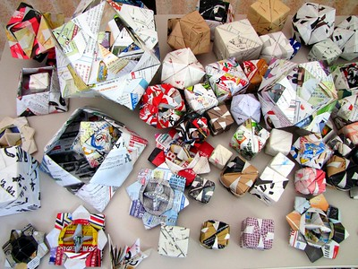

# **Building an R package using {fusen}**

_Image Credit_: "[Origami](https://www.flickr.com/photos/62538557@N06/9448489553)" by [Andy Atzert](https://www.flickr.com/photos/62538557@N06) is licensed under [CC BY 2.0](https://creativecommons.org/licenses/by/2.0/?ref=openverse).

Writing your first full R package can feel overwhelming and {fusen} can help support at this stage. "Fusen" is a type of [Japanese origami](https://en.wikipedia.org/wiki/Kamif%C5%ABsen) in which a flat piece of paper, when folded in a specific way and inflated, turns into a nice paper box/balloon. Similarly, the {fusen} package inflates a flat `.Rmd` template (which is filled in a specific way) and returns a nice package. In this blog post, I am sharing my experience of exploring {fusen} for the first time.

## Pre-requisites

- [RStudio installed](https://posit.co/download/rstudio-desktop/)
- [Connect RStudio to Git and GitHub](https://happygitwithr.com/rstudio-git-github.html) (_Optional, but recommemded_)
