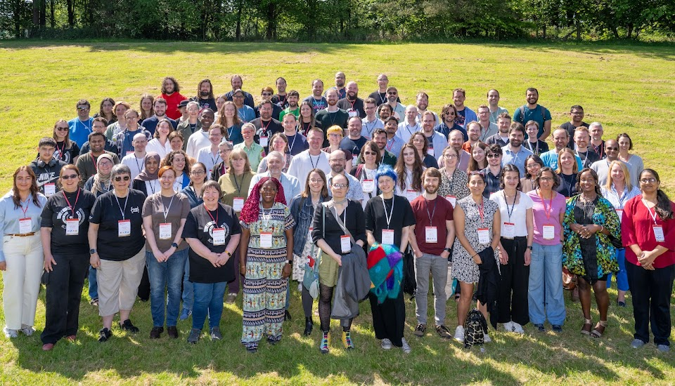

# Collaborations Workshop 2025

{: .no-caption style="display:block;margin:auto;width:69%" }

Several members of Imperial's central RSE team recently attended the [Collaborations Workshop 2025 (CW25)] online and in-person at the University of Stirling, UK. The Collaborations Workshop is the annual flagship event of the [Software Sustainability Institute], which brings together delegates to explore best practices and the future of research software. The official theme for CW25 was “Future-proofing research software: evolving together as a diverse community”.

Alongside keynote talks, the event included lightning talks, workshops, and sessions dedicated to collective idea generation. The last day of the event was dedicated to a collaborative hacking session, where participants were encouraged to get together and work on software projects.

In this blogpost, we share our experiences of attending CW25.

<!-- more -->

## General highlights

The first day included two keynotes, the first from Ruth Nanjala (University of Oxford) regarding the importance of Equality, Diversity & Inclusion (EDI) initiatives. Ruth's talk included a description of her work as a founder of [My Science Journey], a platform that showcases the diverse experiences and perspectives of scientists, providing mentorship and networking opportunities. This theme was further explored during the second day's panel discussion, which focussed on "The Importance of EDI for the Future of Research Software". The topics discussed included the role of community-oriented organisations in shaping EDI in research software, and how open-source software can support under-represented groups. The second keynote, from Kirstie Whitaker (Berkeley Institute for Data Science), described 26 key principles shaping "The Future of Research Software", for example, emphasizing that research software must be trustworthy, accessible and democratising.

The lightning talks showcased ongoing efforts to improve many different aspects of research software and support the people that make it. These included mental health awareness, leadership, software performance (both for speed and sustainability), open source contributions, EDI, and teaching. Jay DesLauriers outlined Imperial's [ReCoDE] project: a collection of Research Computing and Data Science Exemplars for Learning and Teaching.

The event was well structured to ease and encourage networking. The numerous lightning talks allowed for a broad overview of what other participants were working on and the areas they were interested in. Adding to this, the frequent breakout sessions on diverse topics made it easier to find groups with shared interests. Within these sessions and the periods dedicated to socialising, a welcoming atmosphere pervaded the event. The social events featured a performance by a traditional Scottish bagpiper, who proceeded to 'address the haggis' we would be eating that evening, plus a chance to learn three Ceilidh dances.

## Hack Day

Many RSEs from Imperial contributed to the Hack day. In particular, two RSEs contributed to the [DIRECT Framework], which defines and supports digital skills and competencies across research roles. Contributions from the RSE team included contributing to the infrastructure of the sister Django web app, adding linting and logging as well as leading the project management side of the day and demonstrating the web app in the final presentation.

We also began working on bringing support for [CITATION (CFF) files] to GitLab, so that repositories hosted therein can be cited in a similar manner to those hosted on GitHub. This is important for both the sustainability and accessibility of research software, where there may be regional restrictions or preferences for different repository hosting websites.

There was also a contribution to the Turing Way Book Dash project during the Hack Day. In particular, adding chapters on the [Research Community Manager] and [Data Steward pathways].

Finally, a prize-winning project involving members of the RSE team aimed to provide a system of semantic versioning for research publications, inspired by semantic versioning of software, including guidance to researchers on creating reproducible research workflows.

## Summary

Overall, a conscious effort was made by the community to provide a very welcoming, egalitarian, and friendly atmosphere. It was also a good networking opportunity, making it easy to find others with common professional interests.

This latest iteration of the Collaborations Workshop continued to provide inspiration for advancing many aspects of the sustainability of research software, celebrating past achievements, ongoing efforts and motivating future endeavours.

Imperial's RSE Team will continue to be involved and have a presence at future Collaborations Workshops.

[Collaborations Workshop 2025 (CW25)]: https://www.software.ac.uk/workshop/collaborations-workshop-2025-cw25
[Software Sustainability Institute]: https://www.software.ac.uk/
[My Science Journey]: https://mysciencejourney.com/
[DIRECT Framework]: https://github.com/direct-framework/digital-research-competencies-framework/
[CITATION (CFF) files]: https://citation-file-format.github.io/
[ReCoDE]: https://imperialcollegelondon.github.io/ReCoDE-home/
[Research Community Manager]: https://book.the-turing-way.org/pathways/research-community-management-concepts
[Data Steward pathways]: https://book.the-turing-way.org/pathways/data-stewards
