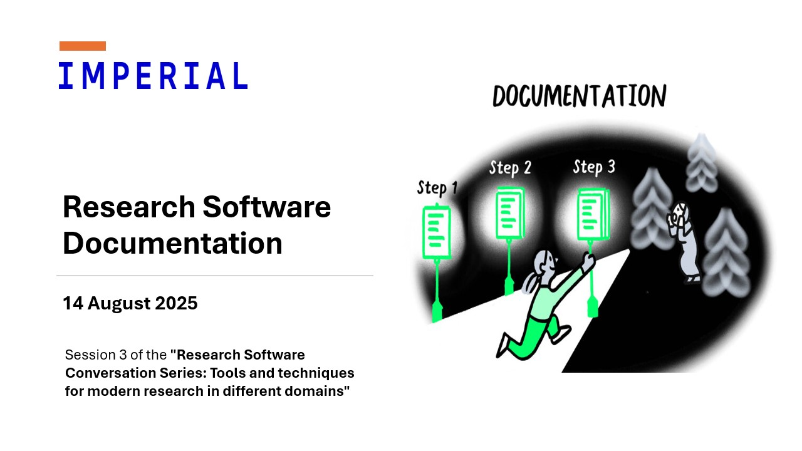

# Research software documentation

{: .no-caption style="display:block;margin:auto;width:69%" }

On Thursday 14th of August, the Imperial College London Research Software Engineering community hosted the third session of the “[Research Software Conversation Series: Tools and techniques for modern research in different domains](https://www.imperial.ac.uk/admin-services/ict/self-service/research-support/rcs/service-offering/research-engagement/rcs-events/rscs/ "https://www.imperial.ac.uk/admin-services/ict/self-service/research-support/rcs/service-offering/research-engagement/rcs-events/rscs/")” titled "Research Software Documentation". This meetup explored the importance of documentation in research software, the challenges faced in writing it, and the best practices to follow.

<!-- more -->

The event involved a roundtable panel discussion with [Emma Russell](https://profiles.imperial.ac.uk/e.russell) (Senior Web Application Developer), [Dr Giovanni Charles](https://profiles.imperial.ac.uk/giovanni.charles10) (Senior Research Software Engineer), [Dr Katy Gaythorpe](https://profiles.imperial.ac.uk/k.gaythorpe) (Assistant Professor in Epidemiology of VPD), and [Dr Richard Fitzjohn](https://profiles.imperial.ac.uk/r.fitzjohn) (Principal Architect, Research Software Engineering Group) and was facilitated by [Saranjeet Kaur Bhogal](https://profiles.imperial.ac.uk/s.bhogal) (Research Software Engineer).

The event was very interactive, with attendees online and in person engaging in discussions and asking questions. The panellists shared their experiences on the topic, which included talking about the types of documentation that can be written for research software (`README`, Getting Started guides, developer guides, reference documentation, etc.), the challenges faced in writing documentation, and the best practices to follow. They also discussed about the factors that contribute to a good user experience when reading/referring to software documentation (the aesthetics, layout, how easy on the eye the documentation is), the importance of planning documentation, and the potential of embedding a "Technical Writer" role within Research Software Engineering teams. Here are some of the key points discussed during the event.

## Planning documentation

The panellists suggested a few key steps to consider when planning documentation for research software:

- Follow "[Documentation Driven Development](https://dev.to/this-is-learning/a-better-way-to-code-documentation-driven-development-1kem)" approach. The article "[Using documentation-driven development for GOV.UK Sign In](https://gds.blog.gov.uk/2022/05/09/using-documentation-driven-development-for-gov-uk-sign-in/)" discusses how instead of documenting your code, you code your documentation, as a low-cost way of prototyping your code. An earlier blog post on our series of blogs also discusses a [documentation first approach to building an R package](https://imperialcollegelondon.github.io/RSEBlog/2025/02/10/building-an-r-package-using-fusen/).
- Provide a high-level narrative of the software, including its purpose, features, and how it can be used. This can be an entry point for users to understand the software. Include a "Getting Started" section that provides a quick overview of how to use the software along with examples.

## How to know if the documentation is being used?

To know if your documentation is being used by the community, you can try sharing your work with them and ask for feedback, conduct workshops or training sessions based on your software and note any questions or issues raised by the users. You can even present your work at conferences, events, or meetups and ask for feedback from the audience. If your software is hosted on a platform like GitHub (with appropriate license), you can ask your users to create issues or pull requests to report bugs or suggest improvements.

If you would like to know whether your co-developers are using your documentation, then one way is to avoid re-stating how to use the software in the pull requests where you are requesting their feedback/reviews. Instead, you can refer them to the documentation, say, by including a link to the relevant documentation section in the pull request description. If they are able to use the software without any issues, then it is a good indication that the documentation is clear and effective. If they have questions or issues, then it can be an indication that the documentation needs improvement. Whether they report issues or are able to use the software without any issues, it indicates that they have been using the documentation.

## The Technical Writer

There was also a discussion about the potential of embedding a "Technical Writer" role within Research Software Engineering teams. Having a professional technical writer who has experience explaining complex concepts in simple terms can be beneficial for creating high-quality documentation.

## Motivations for writing documentation

The panellists discussed why to put in the effort in writing documentation for research software and shared some of the positive experiences they gained from doing so:

- Helping your own self: Writing documentation helps you understand your own code better. It forces you to think about the design and functionality of your software, leading to better code quality. It saves you time as a maintainer/developer in the long run, as you won't have to spend time figuring out how your code works.
- Software is written to be used, hence, users need to understand how to use it. Good documentation helps users understand the software, leading to better user experience.
- Research can be complex and writing software can be challenging. Combining the two and building "research software" becomes an even more complex task, and documentation helps in making it easier for others.
- Documentation is a form of communication. It helps in providing context and how the software can be used appropriately.
- Software papers can be a way to showcase the "why" of the software and also to share the journey of building it.

## Some tips for learning how to document research software better

Find some established documentation and read it. Look for documentation that is well-structured and easy to follow. This will give you an idea of what good documentation looks like. Depending on the programming language, you can refer to documentations of packages that are up to date and popular within the community, for example, [Tidyverse packages](https://www.tidyverse.org/packages/), [SciPy documentation](https://docs.scipy.org/doc/scipy/), [SciML documentation](https://docs.sciml.ai/Overview/stable/), etc. Another great way to learn is to start contributing to open-source project documentation. This is a great way to not only learn how to write good documentation but also to get feedback from experienced developers.

## What the panellists wish they knew about research software documentation when they were just starting out?

- People writing the documentation are also trying to figure it out during the process. It is important to remember that documentation is a process, and there is no such thing as a "perfect documentation". It is always a work in progress and should evolve with the software.
- Use badges and logos to make documentation visually appealing and engaging.
- PDF is not the best format for documentation. It is better to use formats that are more accessible and easier to update.
- Promotion of documentation is key. It is important to make sure that the documentation can be easily discovered and accessed by users. For example:
  - [rOpenSci's monthly News Digest](https://ropensci.org/blog/) regularly features a section on "Software" that features new packages that became a part of their software suite and also new versions of existing packages.
  - [pyOpenSci's Software Peer Review](https://github.com/pyOpenSci/software-submission?tab=readme-ov-file) is an open peer review process for scientific Python packages. In addition to getting your software reviewed, it also provides a platform to showcase your work and get feedback from the community (reference: [The Benefits of Submitting a Package to pyOpenSci](https://www.pyopensci.org/software-peer-review/about/benefits.html))

Overall, the session was a great opportunity to learn about the importance of documentation in research software, the challenges faced in writing it, and the best practices to follow. With that we conclude this season of the Research Software Conversation Series. We hope to see you at the next one!
