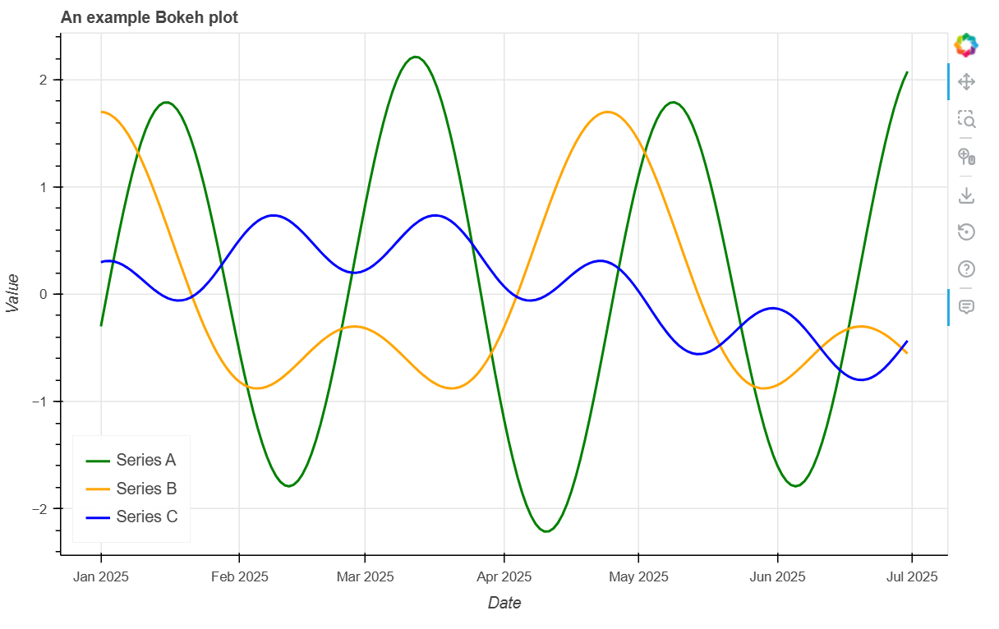
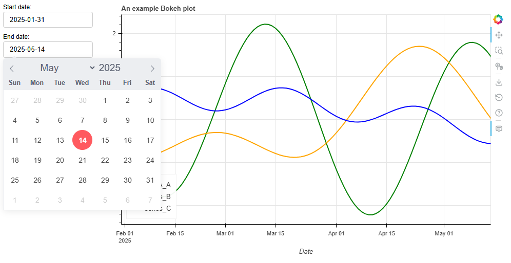
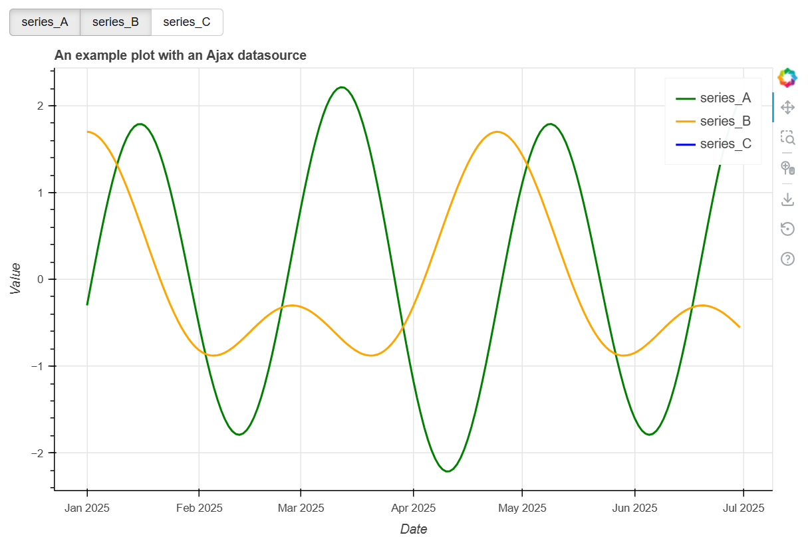

# Plotting in Django with Bokeh

Last year, I was involved in developing one of the RSE team's internal projects, [ProCAT](https://github.com/ImperialCollegeLondon/proCAT),  our internal web application for Project Charging and AnalyTics. ProCAT allow us to monitor key metrics such as time spent on project work and the remaining funding, automatically generating the monthly charges to be made to each funding source. It also helps the team to compare projected team capacity with anticipated workload, making it easier to plan ahead.

We built ProCAT using [Django](https://www.djangoproject.com/), the RSE team's preferred framework for creating web applications. One important design choice was selecting which library to use for generating our analytics plots, which forms the subject of today's blog post.

<!-- more -->

## Choosing a plotting library

For ProCAT, the requirement was to provide interactive timeseries charts, allowing the user to zoom in, use tooltips, select the time range to be displayed and apply filters to select which data to display.

In some of our past projects, we have used [Plotly Dash](https://django-plotly-dash.readthedocs.io/en/latest/index.html#), a framework well-suited to creating interactive, data-driven dashboards. However, based on these experiences, we decided to explore lighter-weight options that could render faster. As this was an internal project, it also provided a convenient opportunity to try out a new library. For this purpose, we chose to use [Bokeh](https://docs.bokeh.org/en/latest/#), a library for creating interactive visualisations powered by JavaScript.

Below, I will provide an easy tutorial to fulfil these requirements and begin creating your own visualisations! Code for this tutorial is available on [GitHub](https://github.com/stephwills/bokeh-django-tutorial).

## Tutorial

### Creating an initial Bokeh plot

First, we'll run through how to create a basic plot in Bokeh and embed it in your Django application. As described in their [documentation](https://docs.bokeh.org/en/latest/docs/first_steps/first_steps_1.html), Bokeh combines a Python library, where you define your plot and the interactive functionality, and a JavaScript library, BokehJS, which works in the background to display your plots in the browser.

The `bokeh.plotting` module contains all the necessary functions to create your visualisation. To add data to  your plot, you need to define your [data source](https://docs.bokeh.org/en/latest/docs/user_guide/basic/data.html). The most common type of data source is the `ColumnDataSource` object; this is automatically created if you pass a list or array to your Bokeh function, but you can also create a `ColumnDataSource` yourself from a dictionary of data or a Pandas dataframe. Here, we use some example data stored in a CSV to create the data source from a dataframe.

```py
import pandas as pd
from bokeh.models import ColumnDataSource

df = pd.read_csv(csv)
df["dates"] = pd.to_datetime(df["dates"]).dt.date
source = ColumnDataSource(df)
```

The `figure` class creates a Bokeh figure for plotting. We can then plot our data; for line charts, this is done using the `line()` glyph method. The code snippet below also demonstrates how to define features such as the title, dimensions, background colour, axis range and labels. We have defined a `plot_config` for convenience, consisting of a dictionary that maps the label names (column headings in the `ColumnDataSource`) to the colour of the associated line in the plot.

```py
from bokeh.plotting import figure

plot = figure(
    title="An example Bokeh plot",
    height=500,
    width=800,
    x_axis_type="datetime"
  )
plot.yaxis.axis_label = "Value"
plot.xaxis.axis_label = "Date"

plot_config= {
    "series_A": "green",
    "series_B": "orange",
    "series_C": "blue"
}

for label, colour in plot_config.items():
    plot.line(
        "dates",
        label,
        name=label,
        source=source,
        line_width=2,
        legend_label=label,
        color=colour
    )
```

It is also easy to add some basic interactive functionality at this point using Bokeh's [plot tools](https://docs.bokeh.org/en/latest/docs/user_guide/interaction/tools.html). Some tools are added as default in a toolbar attached to the plot (for example, zooming, saving and resetting the figure). To add a `HoverTool` so we can see tooltips, we can do the following:

```py
from bokeh.models import HoverTool

hover = HoverTool()
hover.tooltips = [
    ("Month", "@months"),
    ("Total", "£@values"),
]
plot.add_tools(hover)
```

### Adding a Bokeh plot to your HTML template

Once you have defined your plot, the next step is displaying it within your Django view. This uses the `bokeh.embed` module, which enables embedding of the Bokeh figure into a web page. Specifically, `embed.components` is used to return HTML components that can then be added to the HTML template.

```py
from bokeh.embed import components

script, div = components(plot)
```

This can then be added to Django's [context](https://docs.djangoproject.com/en/6.0/ref/templates/api/#django.template.Context) for use in the template.

```py
import bokeh

# Within your Django view
def get_context_data(self, **kwargs: Any):
    context = super().get_context_data(**kwargs)

    plot = make_plot()  # make_plot() returns the Bokeh figure
    script, div = components(plot)
    context["script"] = script
    context["div"] = div

    # We will also need to add the bokeh_version (see below)
    context["bokeh_version"] = bokeh.__version__
    return context
```

It is important to note that, to use these components, the BokehJS resources must be loaded, which can be done by referencing the relevant files from Bokeh's CDN (more information can be found here). This requires specifying the Bokeh version, which we can also add to the Django context to use in the template (see [documentation](https://docs.bokeh.org/en/latest/docs/reference/embed.html#bokeh.embed.components) for more details).

```HTML
<script src="https://cdn.bokeh.org/bokeh/release/bokeh-{{ bokeh_version }}.min.js"></script>
<script src="https://cdn.bokeh.org/bokeh/release/bokeh-widgets-{{ bokeh_version }}.min.js"></script>
<script src="https://cdn.bokeh.org/bokeh/release/bokeh-tables-{{ bokeh_version }}.min.js"></script>
<script src="https://cdn.bokeh.org/bokeh/release/bokeh-gl-{{ bokeh_version }}.min.js"></script>
<script src="https://cdn.bokeh.org/bokeh/release/bokeh-mathjax-{{ bokeh_version }}.min.js"></script>
```

Following this, you should now have your Bokeh plot rendered in your Django view!



### Creating interactive widgets

Next, we'll move onto how we can add [widgets](https://docs.bokeh.org/en/latest/docs/user_guide/interaction/widgets.html) to our Bokeh plots, which is where Bokeh's powerful interactive functionality comes in. Here, we'll demonstrate the use of the [`DatePicker`](https://docs.bokeh.org/en/latest/docs/user_guide/interaction/widgets.html#datepicker) widgets to select the start and end dates for the plots.

To create the `DatePicker` widgets, we define some text to display, the default date selected and a minimum and maximum possible date:

```py
from datetime import date
from bokeh.models.widgets import DatePicker

start_picker = DatePicker(
    title="Start date:",
    value=date(2025, 1, 1),
    min_date=date(2024, 1, 1),
    max_date=date(2026, 1, 31)
)

end_picker = DatePicker(
    title="End date:",
    value=date(2025, 6, 30),
    min_date=date(2024, 1, 1),
    max_date=date(2026, 1, 31)
)
```

To control the behaviour that results from interacting with a widget, we have to attach a callback. If running a Bokeh server, this can be done using [Python callbacks](https://docs.bokeh.org/en/latest/docs/user_guide/interaction/python_callbacks.html). However, if instead using a standalone Bokeh plot as we are doing here, this is done using [JavaScript callbacks](https://docs.bokeh.org/en/latest/docs/user_guide/interaction/js_callbacks.html), where we can provide some custom JavaScript to run when an event is detected.

The following demonstrates how we can modify the plot's x-range using the date pickers:

```py
from bokeh.models import CustomJS

callback = CustomJS(
    args=dict(
        start_picker=start_picker,
        end_picker=end_picker,
        x_range=plot.x_range
    ),
    code="""const start = Date.parse(start_picker.value);
        const end = Date.parse(end_picker.value);
        x_range.start = start
        x_range.end = end""",
)

start_picker.js_on_change("value", callback)
end_picker.js_on_change("value", callback)
```

### Adding our Bokeh elements to a layout

A useful feature in Bokeh is the ability to create [layouts](https://docs.bokeh.org/en/latest/docs/user_guide/basic/layouts.html), consisting of a grid of components (plots and widgets), making it easier to arrange and size the visualisations in your window. We can set the `sizing_mode`, determining how the dimensions of the plot change with the size of the window.

To create a layout with our plot and two widgets:

```py
from bokeh.layouts import column, row

layout = row(
    column(start_picker, end_picker),
    column(plot),
    sizing_mode="stretch_width"
)
```

The layout can then be used to generate the HTML components to be added to the template (as was done for the Bokeh plot):

```py
# Within your view's get_context_data method
script, div = components(layout)
context["script"] = script
context["div"] = div
```



### Ajax data sources (plus more advanced widgets)

Sometimes we may want our plots to be able to update dynamically without having to run a Bokeh server. Bokeh provides a convenient way of doing this using the [`AjaxDataSource`](https://docs.bokeh.org/en/latest/docs/reference/models/sources.html#bokeh.models.AjaxDataSource), a data source that can fetch data from REST endpoints using Ajax requests.

To demonstrate the capabilities of both the `AjaxDataSource` and Bokeh's widgets, the following example shows how we can create separate data sources for each trace, supplied by a new `DataView`, and adds a new widget to control which trace we want to display.

First, we create an `AjaxDataSource` for each trace, each pointing to a different URL. Each line in the plot is bound to its own data source and is given a polling interval, meaning the data can be updated. Note we also assign a `name` to the renderer for each line (this will be used later when configuring the widget).

```py
from bokeh.models import AjaxDataSource

plot = figure(
    title="An example plot with an Ajax data source",
    height=500,
    width=800,
    x_axis_type="datetime"
)
plot.yaxis.axis_label = "Value"
plot.xaxis.axis_label = "Date"

# Plot config is the same as in the first plot
plot_config= {
    "series_A": "green",
    "series_B": "orange",
    "series_C": "blue"
    }

for label, colour in plot_config.items():
    source = AjaxDataSource(
        data_url=f"/data/{label}",
        polling_interval=1000,
        method="GET"
    )

    plot.line(
        "dates",
        label,
        name=label,
        source=source,
        line_width=2,
        legend_label=label,
        color=colour
    )
```

We then need to create a new Django view to return the data requested by each data source. The view receives the `label` from the URL and retrieves the data (a dictionary containing the dates and relevant values) using our `get_series_data` function. This is subsequently returned as a `JsonResponse`.

```py
from django.http import HttpRequest, JsonResponse
from django.views.generic import View

class DataView(View):
    """View for returning data to the AjaxDataSource."""

    def get(
        self, request: HttpRequest, label: str, *args: Any, **kwargs: Any
    ) -> JsonResponse:
        """Method to handle GET requests for Ajax data."""
        # Data dictionary containing relevant values, e.g.
        # {"dates": [ ... ], "series_A": [ ...]}
        data = get_series_data(label)
        return JsonResponse(data)
```

The URL is also added to `urls.py`, as follows:

```py
urlpatterns = [
    # ... other URLs
    path("data/<str:label>", views.DataView.as_view(), name="data"),
]
```

We now have a plot with data provided by `AjaxDataSource`s capable of dynamic updates! As an extension, we will now add a widget that enables users to select which trace(s) should be displayed in the plot. We can use a [`CheckboxButtonGroup`](https://docs.bokeh.org/en/latest/docs/reference/models/widgets/groups.html#bokeh.models.CheckboxButtonGroup) to do this, which allows multiple values to be selected simultaneously.

The code below demonstrates how to do this. The JavaScript callback reacts to button clicks by retrieving the indices of the selected trace label(s) and updating which renderers are visible using the `name` property that was assigned earlier.

```py
from bokeh.models.widgets.groups import CheckboxButtonGroup

# The active argument determines which options are selected as default
button = CheckboxButtonGroup(labels=labels, active=[0, 1, 2])

callback = CustomJS(
        args=dict(
            button=button,
            plot=plot,
            labels=labels  # This is the list of label names
        ),
        code="""
            const selection = button.active;

            plot.renderers.forEach(renderer => {
                const index = labels.indexOf(renderer.name);
                const visible = selection.includes(index);
                renderer.visible = visible;
            });"""
    )
    button.js_on_event("button_click", callback)
```

Now, we should have a working plot using `AjaxDataSource`s with our `CheckboxButtonGroup` widget.



## Summary

Hopefully this blog post provides a useful introduction to using Bokeh in Django and will help you to start creating your own visualisations. Overall, our conclusions from using this library are that it can be powerful for creating visually appealing, interactive visualisations, without requiring extensive JavaScript. While at some points it was challenging to work out some of the more complicated functionality due to a lack of examples to follow (for example, regarding widgets, callbacks and the Ajax data sources), we were able to create plots that fulfilled our requirements without having to run a separate Bokeh server. We look forward to building on what we've learnt using Bokeh in future RSE projects!
