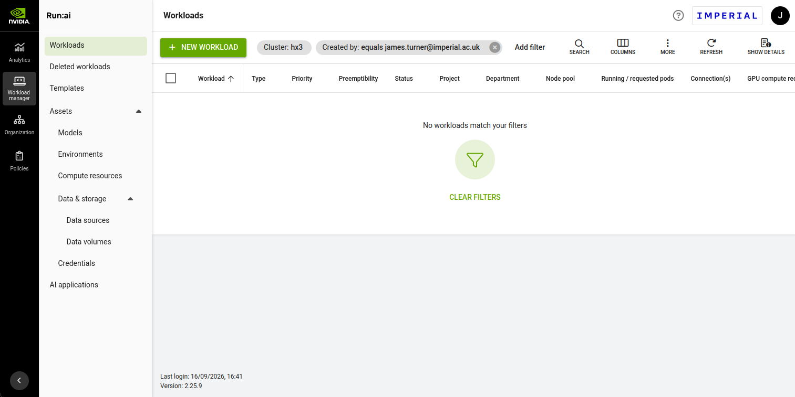

# Deploying an LLM Inference Server

For better or worse, the age of the Large Language Model (LLM) has officially arrived. With it comes fresh new opportunities and problems for humanity, such as increased worker productivity alongside massively increased energy demand and job displacement. The widespread adoption of LLMs from just a few key suppliers brings other issues, such as vendor dependence and data security concerns. Besides this, private research and development of these models continues at a blistering pace. Because of the needs of researchers and private vendors, and perhaps also the other issues, a new trend has emerged whereby private instances of LLMs are deployed locally on personally owned or rented infrastructure. New software stacks, such as the [open source vLLM][vLLM], or [Nvidia's proprietary NIM][NIM], have appeared to fill the niche of LLM deployment and administration.

In this article, we explore the process of private LLM deployment using [Nvidia Run:ai][Run:ai] on Imperial College London's new [HX3 cluster][RCS_offerings] for AI computing. We begin with a short overview of the HX3 cluster and its usage, followed by a quick look over the software stack we will be utilising for our deployment, including its web and command line interfaces. Finally, we get down to business and deploy our own model onto the HX3 cluster and play around with it a little.

## Prerequisites

This guide will make heavy use of [Bash][bash], the popular command interpreter shell for UNIX systems, though [Z shell][zsh] or similar will also work. Linux and Mac users will have at least one of these already installed, but Windows users will need to set up and use the [Windows Subsystem for Linux (WSL)][WSL] to follow along. Other tools, such as `curl` and `jq` are usually available on these systems, but are easily installable if not using that system's package manager. With our software dependencies now ready, let's first talk about [Imperial's HX3 compute cluster][RCS_offerings].

## Imperial HX3

HX3 is Imperial College London's brand new HPC cluster dedicated entirely to GPU-accelerated compute workloads for AI teaching and research. This guide is mainly targeted at students and staff members at Imperial; if you are not an Imperial student or staff member, then try contacting your own institution's HPC department; you may have access to equivalent infrastructure with which to follow along with this guide.

### Accessing the HX3 Compute Cluster

You can request access to this compute environment by reaching out to your department's HPC representatives. Depending on your requirements, you may be allocated a personal 'project' workspace, with which you can submit compute workloads using your personal quota. Otherwise, you may instead be added to a department-specific project with its own compute quota which is shared with others in your department.

Once appropriate access has been granted, you may proceed to the web interface of HX3, used to submit and manage workloads. For Imperial users, the web interface is accessible by pointing your web browser to <https://runai.hx3.hpc.ic.ac.uk>. NB you will need to either be connected directly to Imperial's local network or connected via the Zscaler proxy service to access the interface.

### The Run:ai Interface

HX3 uses [Nvidia's Run:ai][Run:ai] platform to submit and manage AI compute workloads. Run:ai has two interfaces: the web interface discussed already, which you can connect to by following the link above, and the Command Line Interface (CLI), which we will be using throughout the bulk of this guide. Before that, though, take a second to familiarise yourself with the web interface. From the landing page, you will see a page describing your submitted workloads, along with controls for starting, managing and deleting them. Deleted workloads may be accessed and restarted by following the 'Deleted workloads' on the navigation panel on the left. User settings, including API token generation, is accessed by clicking on your profile avatar in the top right of the page.



Since we will be using the CLI client, click the question mark icon in the top right of the page, near to your avatar icon, and click `Researcher Command Line Interface`. Follow the instructions on the popup window to download and install your personal CLI client, which will be made available as `runai` on the command line. Now open a fresh terminal so that Run:ai can properly initialise, and then login with the client by running `runai login`. If successful, you now have a fully working CLI client to submit jobs. Now as a final configuration step, make sure to point the client to whichever compute project you were assigned to. Set an environment variable `PROJECT=<project name>` and run `runai project set ${PROJECT}`. You can check the name of your project by running `runai project list`. Now we can move on to something more interesting.

## Deploying the LLM

Run:ai workloads can be classified as one of three things: either 'Workspace', 'Training' or 'Inference'. A workspace is useful as space for developing and running Jupyter notebooks in an isolated container environment. The training workload, as you might expect, is a specialised environment from which AI models can be trained in a controlled and repeatable manner. Since the LLM models we will be using have already been fully trained, we will be using the inference workload type, used for deploying fully trained AI models and exposing them to users via a web API.

Let's begin by listing our submitted workloads with `runai workload list`. If you are part of a department-wide project group, you may see several workloads submitted by others in your group, along with their status. If you have been allocated a fresh project group, the returned list will be empty as we have not submitted anything yet. Let's fix that. Decide a name for the workload and set the environment variable `WORKLOAD` with it. I'll use `WORKLOAD=vllm-smoke`, but you may need to pick another one if this one is already taken. Our next command is as follows:

```bash
runai inference submit ${WORKLOAD} \
    -i vllm/vllm-openai:latest \
    --gpu-devices-request 1 \
    --serving-port 8000 \
    -- Qwen/Qwen3-0.6B
```

We can follow the startup process of the model by running `runai inference logs ${WORKLOAD} --follow` and wait until the container is fully deployed and awaiting requests.

It's worth unpacking the previous command a bit, as several things are happening under the hood at once. First, let's discuss the command itself.

1. `runai inference submit` tells the Run:ai platform that we want to submit a request for an 'inference' type workload, as discussed above.
1. The workload name, which we have already saved in our `WORKLOAD` environment variable. This will be the name visible when running `runai workload list`.
1. `-i vllm/vllm-openai:latest`. This instructs Run:ai to load the vLLM and OpenAI container, which is a pre-built environment containing the inference server itself, which is the vLLM OpenAI-compatible server image.
1. `--gpu-devices-request 1` requests a single GPU for the workload.
1. `--serving-port 8000` exposes the workload's vLLM inference server on port 8000.
1. `Qwen/Qwen3-0.6B` is the [Hugging Face][HuggingFace] tag for the model we are using.

NB there are some good reasons you might want to request a different number of GPUs. You may have noticed when calling `runai project list` that the returned table has a column named `Allocated GPUs`. Depending on your quota, two other scenarios may exist: your GPU quota may be less than, or greater than one. Additionally, if your project is shared with other users, you may find that there is not enough quota left after other workloads for your job to request a whole GPU. If there is not enough quota for your job, you may request 'fractional' GPU usage, where some fraction of a non-full GPU is requested instead. Although only proportionate GPU memory is reserved, it's a viable option when not enough GPU quota exists. For a fractional half GPU request, for example, replace `--gpu-devices-request 1` in your `submit` call with `--gpu-request-type portion --gpu-portion-request 0.5`, and your workload will run on half of a shared GPU. On the other hand, if your remaining GPU quota is above one, you might consider requesting more to run a bigger model faster. This, however, is outside the scope of this guide.

By now, our LLM should be up and running on a HX3 node, as evident in the workload's log. For testing purposes, we will forward the remote port (8000) from the HX3 node to `localhost`, allowing us to transmit HTTP requests through a tunnel to our vLLM inference server. To do so, run the following in a separate command line terminal: `runai inference port-forward ${WORKLOAD} --port 8000:8000`. We may now pass our HTTP requests to the vLLM server via `localhost` port 8000. With that, we can now move on to passing some queries.

## Sending Requests to the LLM

Our goal in this section is to see how to construct LLM requests, and see what LLM responses look like, through the OpenAI-compatible interfacing API. We will also learn how to send and receive these messages using command line tools. We chose `Qwen/Qwen3-0.6B` earlier as it is a (relatively) small model that is good enough to demonstrate basic usage. Let's start simple. We will use the command line program `curl` to send HTTP requests to our inference server's API. For this, we must construct a message which selects the correct model to use, tells the model we are acting as a user and specifies the content of our message. Run the following command in your terminal:

```bash
curl http://localhost:8000/v1/chat/completions \
    -H 'Content-Type: application/json' \
    -d '{
        "model": "Qwen/Qwen3-0.6B",
        "messages": [
            {
                "role": "user",
                "content": "In one sentence, what is Imperial College London?"
            }
        ],
        "max_tokens": 50
    }'
```

You'll see that the request is structured as JSON, with fields compatible with the OpenAI API format, which is quite standard in LLM inference. For `model`, we specify the model's tag (the one we set up earlier is `Qwen/Qwen3-0.6B`), and each `message` specifies its sender's `role` (which is `user` here) and its `content`. Note also our `max_tokens` choice of 50. The response you receive might look a little like this:

```text
"role": "assistant",
"content": "<think>\nOkay, the user is asking for a one-sentence definition of Imperial College London. Let me start by recalling what I know about the university.\n\nImperial College London is a prestigious institution located in London. It's known for its research and",
```

As you can see, there was a slight issue with the response. It seems the `Qwen/Qwen3-0.6B` model we selected has a 'think' ability, but this 'thinking' is taking much of our token allowance. We have a couple of options. The first is to disable this thinking behaviour by passing another option flag with our JSON query, like so:

```bash
curl http://localhost:8000/v1/chat/completions \
    -H 'Content-Type: application/json' \
    -d '{
        "model": "Qwen/Qwen3-0.6B",
        "messages": [
            {
                "role": "user",
                "content": "In one sentence, what is Imperial College London?"
            }
        ],
        "max_tokens": 50,
        "chat_template_kwargs": {
            "enable_thinking": false
        }
    }'
```

Here's the response I got:

```text
"role": "assistant",
"content": "Imperial College London is a world-renowned British university located in London, providing a wide range of academic and professional opportunities.",
```

That's more like it! It's a little short and basic, though. Let's turn thinking back on and increase the token quota:

```bash
curl http://localhost:8000/v1/chat/completions \
    -H 'Content-Type: application/json' \
    -d '{
        "model": "Qwen/Qwen3-0.6B",
        "messages": [
            {
                "role": "user",
                "content": "In one sentence, what is Imperial College London?"
            }
        ],
        "max_tokens": 1000
    }'
```

The response I get now is:

```text
"role": "assistant",
"content": "<think>\nOkay, the user is asking for a one-sentence definition of Imperial College London. Let me start by recalling what I know about the institution. Imperial College London is a prestigious university located in London, UK, known for its strong academic programs and research. I need to make sure the sentence is concise and includes key details like location, type of institution, and notable aspects.\n\nFirst, I should mention the university's name. Then, its location. Next, the type of institution. Also, the reputation or achievements. Let me check if there's any specific information I should include. For example, the fact that it's a public institution or its focus areas. Maybe include something about its reputation in the field of education or research.\n\nWait, the user wants it in one sentence. So I need to combine these elements without adding unnecessary words. Let me structure it: \"Imperial College London is a prestigious UK university located in London, offering a wide range of academic programs and research opportunities.\" That seems to cover location, type, and purpose. Let me double-check if there's any other important detail that's missing. No, that should be sufficient. I think that's the correct answer.\n</think>\n\nImperial College London is a prestigious UK university located in London, offering a wide range of academic programs and research opportunities.",
```

Interesting... We can see that this model in particular uses many of its allocated tokens on the 'thinking' phase, before starting to write its final response. Everything inside the `<think>...</think>` tags is the LLM's attempt to reason about the user's question, before providing its final answer after the closing `</think>` tag. Clearly some experimentation is called for! There is a huge selection of models to try from [Hugging Face][HuggingFace] and other AI container sources we can try. The `Qwen/Qwen3-14B` model is a slightly bigger and more capable version of the model we are using now, or alternatively there are many more to choose from. Before we do that, though, let's make sure that our inference server is secure from other users.

## Adding Token-Based Authentication

Right now our inference server is sitting undefended on a node in the HX3 cluster, completely vulnerable to abuse by anyone else with HX3 access. For convenience in our earlier tests, we forwarded our inference server's exposed port to `localhost` using `runai inference port-forward ...`, but our server is also exposed via a URL on the Run:ai platform. This means that anyone with the privilege to access the HX3 Run:ai interface will also have the means to access (and potentially misuse) your inference server. As we are no longer testing, we will no longer expose our server using `runai inference port-forward ...`. Instead, let's figure out the main URL at which our server is exposed. Run `runai workload describe ${WORKLOAD}`, and look for the `Network` section of the resulting output. Let's set an environment variable with the main URL: something along the lines of `WORKLOAD_URL=https://<workload>-runai-<project>.runai-inference.hx3.hpc.ic.ac.uk`, and test it by connecting directly to it:

```bash
curl ${WORKLOAD_URL}/v1/chat/completions \
    -H 'Content-Type: application/json' \
    -d '{
        "model": "Qwen/Qwen3-0.6B",
        "messages": [
            {
                "role": "user",
                "content": "What is the answer to life, the universe and everything?"
            }
        ],
        "max_tokens": 1000
    }'
```

You should receive a response as usual. Note how we never had to authenticate ourselves to make this request (the `curl` command knows nothing about your `runai` login details). Let's fix that. First, delete the existing workload by running `runai workload delete ${WORKLOAD}`. Now save your HX3 Run:ai username to an environment variable, for example `RUNAI_USER=your.email@imperial.ac.uk`, and submit another workload request as follows:

```bash
runai inference submit ${WORKLOAD} \
    -i vllm/vllm-openai:latest \
    --gpu-devices-request 1 \
    --serving-port "container=8000,authorization-type=authorizedUsersOrGroups,authorized-users=${RUNAI_USER},protocol=http" \
    -- Qwen/Qwen3-0.6B
```

The only difference from our previous `submit` call is the value of our `--serving-port` option. Here, we are instructing Run:ai to only allow users which we have added to the option's colon-delimited `authorised-users` list to access the inference server. Once we are up and running again, try to send another query:

```bash
curl ${WORKLOAD_URL}/v1/chat/completions \
    -H 'Content-Type: application/json' \
    -d '{
        "model": "Qwen/Qwen3-0.6B",
        "messages": [
            {
                "role": "user",
                "content": "What should I have for dinner tonight?"
            }
        ],
        "max_tokens": 1000
    }'
```

An empty response; looks like we are locked out. Good. So how do we get in? Let's get ourselves an access token. On the Run:ai web interface, click the avatar icon in the top right of the page, followed by `Settings`. On the settings page, go to the `Access Keys` section and click on the `+ ACCESS KEY` link at the bottom. Enter a name for this new key and the next popup window will show you your new `Client ID` and `Client Secret`. Set new environment variables with these two values: `RUNAI_CLIENT_ID=<your client ID>` and `RUNAI_CLIENT_SECRET=<your client secret>`. Now we can generate our access token using these credentials. Run the following in your terminal, paying careful attention to the use of single `'` and double `"` quotes:

```bash
RUNAI_TOKEN=$(
    curl -s 'https://runai.hx3.hpc.ic.ac.uk/api/v1/token' \
        -H 'Content-Type: application/json' \
        -d "$(jq -n \
            --arg client_id "${RUNAI_CLIENT_ID}" \
            --arg client_secret "${RUNAI_CLIENT_SECRET}" \
            '{
                grantType: "client_credentials",
                clientId: $client_id,
                clientSecret: $client_secret
            }')"
    | jq -r '.accessToken'
)
```

`jq` is simply a CLI tool for parsing and generating JSON expressions. All we are doing here is constructing JSON `client_credentials` request data with your `clientId` and `clientSecret`, passing it to the Run:ai `/api/v1/token` endpoint, and saving our new `accessToken` it returns in the environment variable `RUNAI_TOKEN`. Now let's try our inference server again, using our new access token. Again be mindful about single `'` and double `"` quotes. Environment variables are *not* substituted inside the former, only the latter.

```bash
curl ${WORKLOAD_URL}/v1/chat/completions \
    -H 'Content-Type: application/json' \
    -H "Authorization: Bearer ${RUNAI_TOKEN}" \
    -d '{
        "model": "Qwen/Qwen3-0.6B",
        "messages": [
            {
                "role": "user",
                "content": "Is my cat trying to kill me?"
            }
        ],
        "max_tokens": 1000
    }'
```

Note the new `Authorization` header in our HTTP request, which contains our new access token. Assuming all has gone well, you'll notice that we get a non-empty response this time, meaning the inference server has accepted our access token and is allowing us to send queries to the LLM. Excellent. Note that these access tokens periodically expire, so you may need to request another token if you suddenly start receiving empty responses later on. Now, with our inference server deployed and secure, let's look at a nifty little way to use our LLM: tool calling.

## LLM Tool Calling

To start with, let's find a more capable model such as the `Qwen/Qwen3-14B` one we mentioned earlier. Delete the existing workload with `runai workload delete ${WORKLOAD}` and start an instance of our more capable LLM by running the following:

```bash
runai inference submit ${WORKLOAD} \
    -i vllm/vllm-openai:latest \
    --gpu-devices-request 1 \
    --serving-port "container=8000,authorization-type=authorizedUsersOrGroups,authorized-users=${RUNAI_USER},protocol=http" \
    -- Qwen/Qwen3-14B \
    --enable-auto-tool-choice \
    --tool-call-parser hermes \
    --reasoning-parser qwen3
```

Note the change in tag to our new bigger model at the end of the command. Note also the new options being passed to the model: `--enable-auto-tool-choice` and `--tool-call-parser hermes` enables automatic tool selection and parses the model's output into OpenAI API-compatible tool call messages. Both the `Qwen3` models we have tried so far recommend the `hermes` parser, but other models may need different tool parsers. Finally, `--reasoning-parser qwen3` is required to parse the `Qwen3` models' `<think>...</think>` syntax we have been seeing when model thinking is enabled. Now onto LLM tool use.

### A Simple Tool Calling Example

Now that our shiny new inference server is running, let's look into LLM tool usage more generally with an example. We will offer a dummy local `get_weather` tool to our LLM to see what tool requests actually look like before moving onto something more complicated. Run the following in your terminal:

```bash
curl ${WORKLOAD_URL}/v1/chat/completions \
    -H "Authorization: Bearer ${RUNAI_TOKEN}" \
    -H 'Content-Type: application/json' \
    -d '{
        "model": "Qwen/Qwen3-14B",
        "messages": [{
            "role": "user",
            "content": "What is the weather in London? Use the weather tool."
        }],
        "tools": [{
            "type": "function",
            "function": {
                "name": "get_weather",
                "description": "Get the current weather for a city",
                "parameters": {
                    "type": "object",
                    "properties": {
                        "city": {
                            "type": "string"
                        }
                    },
                    "required": ["city"]
                }
            }
        }],
        "tool_choice": "auto"
    }' | jq
```

Note that we piped the response into the `jq` JSON parser, for nicely formatted output. Our response should contain something like the following:

```text
"role": "assistant",
"content": null,
"refusal": null,
"annotations": null,
"audio": null,
"function_call": null,
"tool_calls": [
  {
    "id": "chatcmpl-tool-aaefba00c341c8c5",
    "type": "function",
    "function": {
      "name": "get_weather",
      "arguments": "{\"city\": \"London\"}"
    }
  }
],
"reasoning": "\nOkay, the user is asking about the weather in London and wants me to use the weather tool. Let me check the available functions. There's a function called get_weather that takes a city parameter. The required parameter is city, which in this case is London. So I need to call get_weather with city set to London. I'll make sure to format the tool call correctly in JSON inside the XML tags.\n"
```

You'll see in the output that our LLM has correctly determined that it needs to run our dummy `get_weather` tool with a single `city` argument equal to `London`. This dummy tool does nothing, but you might be already imagining some more useful tools we could implement, such as `write_file` or `set_alarm`, which we can give our LLM access to. Now let's see if we can get our model to do agentic coding in an IDE.

### Using the LLM for Agentic Coding

For the purposes of checking agentic coding out using a private LLM deployment, let's make use of the [Visual Studio Code][VSCode] IDE, henceforth `vscode`, which is freely available on most operating systems, and already supports using custom LLM servers straight out of the box. Get started by launching `vscode`, and we'll start configuring our LLM as a coding agent. In the text box at the top of the main window, type `> Chat: Manage Language Models` to bring up the LLM management window. Then click `Add Models` in the top right, followed by `Custom Endpoint`. Give it a name, such as `Imperial HX3`, copy the contents of `echo ${RUNAI_TOKEN}` into the `API Key` text box, and select the `Chat Completions` API. Finally, in the JSON configuration text window that pops up, fill in the remaining fields. Mine looks as follows:

```json
[
    {
        "name": "Imperial HX3",
        "vendor": "customendpoint",
        "apiType": "chat-completions",
        "apiKey": "${input:chat.lm.secret.-6e57da46}",
        "models": [
            {
                "id": "Qwen/Qwen3-14B",
                "name": "Qwen3 14B - HX3",
                "url": "https://vllm-smoke-runai-rse-testing.runai-inference.hx3.hpc.ic.ac.uk/v1/chat/completions",
                "toolCalling": true,
                "vision": false,
                "contextWindow": 40960,
                "maxOutputTokens": 16000
            }
        ]
    }
]
```

Your URL will look slightly different, depending on your project and workload name. Run `echo ${WORKLOAD_URL}/v1/chat/completions`, and set your URL to the result. Remember that your Run:ai API token will expire, and will need periodic updating via the LLM management window. With this done, reload `vscode` by typing `> Developer: Reload Window` in the top command bar, then open the agent chat panel with `> Chat: Open Chat`. We can now select our shiny new LLM agent at the bottom of the agent panel (you may need to click `Other Models` and scroll down). Mine is named `Qwen3 14B - HX3`, as per my JSON configuration. Now comes the fun part; give it a spin inside your own `vscode` code project. In the agent chat window, with our agent selected, type some queries such as `tell me the first line of README.md`, `Write a file at the root of this repository named test.txt with contents 'hello world'`, or even deliberately break something in your project and send resulting errors to the agent, then watching various agent models try to address your queries. Happy experimenting! It's been a long journey, but that is all for now. I hope you've had fun and learnt something. Stay tuned for some more advanced guides on using Imperial's new HPC infrastructure in future issues.

## Final Notes

Thanks for staying with us until the end! You should hopefully feel a little more confident about configuring and deploying your own instances of LLM models on HX3 and trying some new models. Before you leave us, though, just a few extra points that should be kept in mind whilst experimenting. First, please be a good citizen! Shut down your LLMs once you are done with them to free up resources for someone else. You can check which workloads are still running with `runai workload list`, and delete a workflow by running `runai workload delete <workload>`. Second, if doing anything more than testing a model for a short while, you are strongly advised to add token-based authentication to your model, to prevent others from accessing and abusing it. Reach out to your department's HPC representatives if you are unsure whether you need it or require assistance in setting it up. Finally, if you are deploying the same model over and over, consider setting up persistent caching to prevent Run:ai from downloading and compiling the same model over and over, saving bandwidth and speeding up deployment significantly. And now, with that done, go and have some fun!

This post was written by a human.

[RCS_offerings]: https://www.imperial.ac.uk/admin-services/ict/self-service/research-support/rcs/service-offering/
[bash]: https://en.wikipedia.org/wiki/Bash_(Unix_shell)
[zsh]: https://en.wikipedia.org/wiki/Z_shell
[WSL]: https://learn.microsoft.com/en-gb/windows/wsl/
[Run:ai]: https://www.nvidia.com/en-gb/software/run-ai/
[NIM]: https://www.nvidia.com/en-gb/ai-data-science/products/nim-microservices/
[vLLM]: https://vllm.ai/
[HuggingFace]: https://huggingface.co/
[VSCode]: https://code.visualstudio.com/
