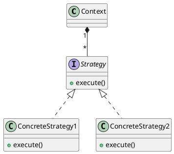
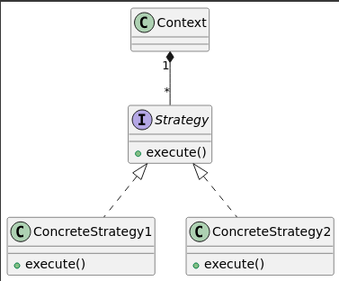
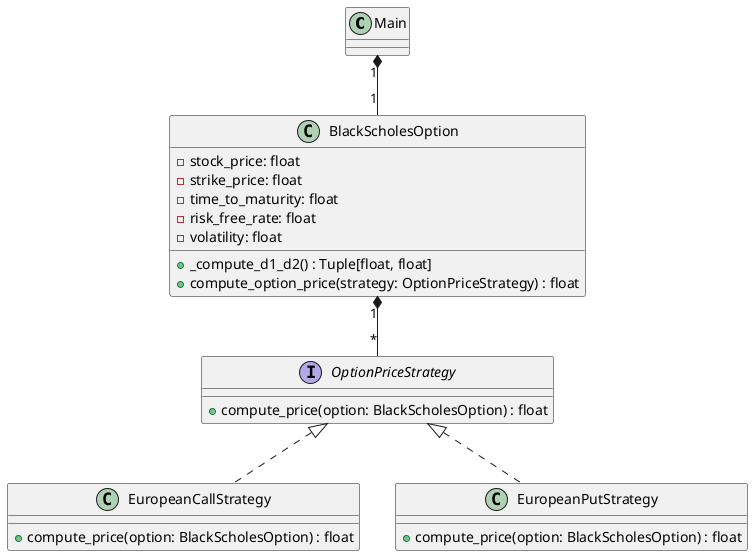
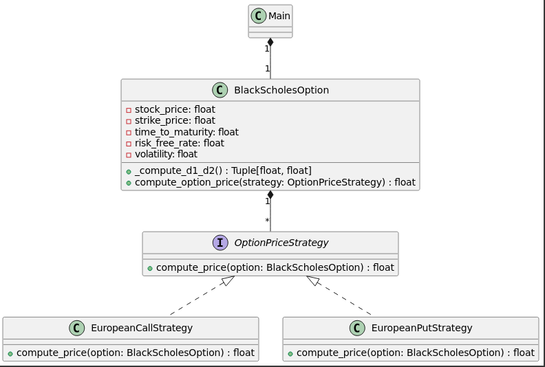

# Understanding software design patterns in Financial Data Science

`Design Patterns` were first introduced in a book titled [Design Patterns: Elements of Reusable Object-Oriented Software](https://www.amazon.com/Design-Patterns-Elements-Reusable-Object-Oriented/dp/0201633612)
, published in 1994 by Erich Gamma, Richard Helm, Ralph Johnson and John Vissides, also known as the `Gang of Four`.
The book lies at the basis of Object-Oriented design theory and practice. A `Design Pattern` is a general, reusable solution to a commonly occurring problem.
One does not just find them in software development, but throughout engineering practice, as
their philosophy is to find standard solutions to common problems in a given field, say, the `Schmidt coupling` in mechanical engineering, see also
 [20 Mechanical Principles combined in a Useless Lego Machine" on YouTube [sic!]](https://www.youtube.com/watch?v=M1-YeqGynlw)

There are, also standard designs for car engines, for instance the four-stroke engine, or the shape of a kitchen sink in plumbing and house design.
This is exactly what design patterns are for software. Each pattern solves a particular problem.
Some of these patterns focus in object creation, some of them focus on testing structure, say a system of objects, and some of them focus on how
objects should communicate.

There is only one problem: The book referenced above is about 30 years old and much has changed in the computing world, including the evolution of
programming languages. "Move fast and fail fast" mentality of start-ups, or, often occurring in the quantitative analysis world in finance
the "focus on the question at hand to answer a particular problem, while caring to a lesser degree, or not at all, on the design of the program".
Many Jupyter notebooks that are written in isolation, are a prime example of that. In that sense many data scientists are stuck on the "make it work"
mantra, rather than progressing to "make it right", and, finally, "make it fast". That is not meant as a criticism, as more often than not, we rework, rewrite or re-manufacture entire parts of our code to achieve the "make it work" step and over-designing a piece of code can be seen as an issue in itself, at least at the prototyping, or "prove of concept" stage. For more mature systems this, however, leads to plenty of technical issues, which are difficult or even impossible to maintain.

Also, `Object-Oriented programming` is not a prime style of writing software anymore, and many modern language have solid `functional programming`
support natively supported. One of such as language is `Python`, where functions are considered first-class citizens, i.e. we can pass them around
like other objects and even make functions take other functions as input parameters.

This blog is aimed at providing an overview of design patterns that one can make use for in `Financial Data Science` applications.
It does not claim to be exhaustive, and you are encouraged to take a look at the original publication, or even, to take the
concepts provided and to implement them in another language of your choice.

<!-- more -->

## A necessary detour: Unified Modeling Language (UML)

Before we delve into the realm of Design Patterns, we should first describe how we can define objects and properties on the
drawing board, similarly as an architect first works on a blueprint before manifesting their ideas in the real world.
In software architecture one such a tool is the `Unified Modeling Language (UML)`. It is a standardised visual modeling
language used in the field of software engineering to specify, visualize, construct, and document the artifacts of software systems.
UML is not a programming language but rather a tool used to help software developers visualise the design of a system.

### How does UML help us in Software Engineering?

UML provides software architects and designers with a language for developing clear models of system design. It includes a set of graphic notation techniques to create visual models of object-oriented software systems.
As a standardised language, UML makes it easier for individuals to understand the software design, whether they are part of the development team or external stakeholders. This helps in both collaborative settings and when transitioning projects between teams.
Moreover, UML diagrams serve as a part of the documentation process, providing several types of diagrams that cater to different aspects of a software system. For example, use case diagrams for requirements gathering, class diagrams for showing static structure, and sequence diagrams for detailing the interactions.
By using UML, software developers can think through the design and discover potential issues before any code is actually written. This can save time and resources in the development process.
Also, UML helps break down complex systems into manageable components, which can be analysed, designed, and implemented independently.
Another strength of UML is that it is platform-independent. This means the same modeling language can be used to design software systems across various platforms.

### Types of UML diagrams

UML includes several types of diagrams, each serving different purposes:

- Structural diagrams (e.g., Class Diagrams, Object Diagrams): Focus on the static aspects of the system.

- Behavioural diagrams (e.g., Use Case Diagrams, Activity Diagrams): Focus on dynamic aspects.

- Interaction diagrams (part of behavioral diagrams, e.g., Sequence Diagrams, Communication Diagrams): Focus specifically on the flow of control and data among the elements in the system.

UML hence is an important tool used across the software development lifecycle, from conceptualisation through to implementation. It helps teams communicate ideas more effectively and builds a foundation for creating a robust architecture. By using UML, developers can ensure that their initial designs can be translated into functional software, making it an important part of modern software engineering practices.

### UML within Jupyter notebooks

Form within Jupyter notebooks, we can make use of a library called `iplantuml` that we can install via pip upon invoking pip install iplantuml.

You can also use it to lay out the structure of your software using the package and use that as a basis for a research report or a dissertation. It is in general a good idea to keep a record of the blueprit of your software, specifically if you implement larger works or production systems.

```python
try:
    import iplantuml
except ImportError:
    !pip install iplantuml
    import iplantuml
```

## Design Patterns

Let us now focus on the Design Patterns themselves.

### Strategy Pattern

The `Strategy Pattern` is used to define a family of algorithms, encapsulate each one, and make them interchangeable.
This pattern allows the algorithm to vary independently of the clients that use it.

The concept of the Strategy Pattern can be outlined as follows.

- Context: This is the class that uses a Strategy. The Context is configured with a ConcreteStrategy object, which it uses to perform a specific algorithm.
- Strategy interface: This defines a common interface for all supported algorithms. The context uses this interface to call the algorithm defined by a ConcreteStrategy.
- ConcreteStrategy: These are the classes that implement the Strategy interface, each providing a specific implementation of the algorithm.

We can code up the UML diagram of the Strategy Pattern as follows.




<!-- markdownlint-disable-next-line MD036 -->
*The rendered result should look similar to the above figure.*

We can now use this our blueprint and engineer software that implements the abstract pattern.
As an example we pick pricing a European call and put option using the `Black-Scholes-Merton` equation, which is
a common task in pricing a vanilla derivative.

The Black-Scholes partial differential equation is given by:

$$
\frac{\partial V}{\partial t} + \frac{1}{2} \sigma^2 S^2 \frac{\partial^2 V}{\partial S^2} + r S \frac{\partial V}{\partial S} - r V = 0
$$

where:

- \( V \) is the price of the derivative (option price)
- \( t \) is the time
- \( S \) is the price of the underlying asset
- \( \sigma \) is the volatility of the underlying asset
- \( r \) is the risk-free interest rate with continuous compounding (c.c.)

Without proof, the following expressions for the price of a European put and call option solve the Black-Scholes equation:

#### European call option price

$$
c = S_0 N(d_1) - K e^{-rT} N(d_2)
$$

#### European put option price

$$
p = K e^{-rT} N(-d_2) - S_0 N(-d_1)
$$

where:

$$
d_1 = \frac{\ln(S_0 / K) + (r + \sigma^2 / 2)T}{\sigma \sqrt{T}}
$$

$$
d_2 = d_1 - \sigma \sqrt{T}
$$

- \( c \) is the price of the call option.
- \( p \) is the price of the put option.
- \( S_0 \) is the current price of the underlying asset.
- \( K \) is the strike price of the option.
- \( r \) is the risk-free interest rate.
- \( T \) is the time to maturity.
- \( \sigma \) is the volatility of the underlying asset.
- \( N(\cdot) \) is the cumulative distribution function of the standard normal distribution.

Let us now implement these pricing equations in a Python program using the `Strategy Pattern`.
While the pattern might seem somewhat abstract at first, the clear separation of concerns it provides can significantly enhance code clarity.

## Implementation with Strategy Pattern

Let us now make use of the definition of the Strategy Design Pattern above and adapt it to the problem at hand. We first define the UML diagram and follow-up
with a code implementation.

### UML diagram




<!-- markdownlint-disable-next-line MD036 -->
*The rendered result should look similar to the above figure.*

Let us go through the `UML diagram` of the `Strategy pattern` in this context in more detail.

In UML diagrams, the `1` and `*` symbols denote multiplicity, which indicates the number of instances in a relationship.
1: This means "exactly one." It indicates that there is a one-to-one relationship.
*: This means "many." It indicates that there is a one-to-many relationship.

- Inheritance:
 `OptionPriceStrategy <|.. EuropeanCallStrategy`
 `OptionPriceStrategy <|.. EuropeanPutStrategy`

  - These lines indicate that `EuropeanCallStrategy` and `EuropeanPutStrategy` both implement the `OptionPriceStrategy` interface. This relationship is depicted using a solid line with a hollow triangle pointing to the interface. It means that both strategies must provide an implementation for the compute_price method defined in the OptionPriceStrategy interface.

- Composition:
`BlackScholesOption "1" *-- "*" OptionPriceStrategy`
This indicates a composition relationship between `BlackScholesOption` and `OptionPriceStrategy`. The `1` near `BlackScholesOption` means that each instance of `BlackScholesOption` can use one or more instances of `OptionPriceStrategy`.
The `*` near `OptionPriceStrategy` means that multiple strategies can be associated with a single `BlackScholesOption` instance.
The filled diamond represents a strong lifecycle dependency, meaning the `OptionPriceStrategy` instances are typically created and destroyed along with the `BlackScholesOption` instance.

- Association:
`Main "1" *-- "1" BlackScholesOption` indicates an association relationship between `Main` and `BlackScholesOption`. The `1` near both `Main` and `BlackScholesOption` signifies a one-to-one relationship.
Each instance of Main is associated with exactly one instance of `BlackScholesOption`. The filled diamond indicates a composition relationship where
`Main` strongly owns or controls the lifecycle of the `BlackScholesOption`.

- Code context:
`OptionPriceStrategy` interface defines a contract for computing option prices.
It has one method, `compute_price`, which takes an instance of `BlackScholesOption` and returns a float.

- `EuropeanCallStrategy` and `EuropeanPutStrategy Classes` implement the `OptionPriceStrategy` interface.
Each provides a specific implementation of the `compute_price` method for `European call and put` options, respectively.

- `BlackScholesOption class` contains attributes for the option parameters (e.g., stock price, strike price, time to maturity, risk-free rate, volatility).
It has a (private) method `_compute_d1_d2` to calculate the `d1` and `d2` values used in the Black-Scholes formula.
The `_compute_option_price` method takes an `OptionPriceStrategy` instance and uses it to compute the option price.

- `Main Class`: Responsible for creating instances of `BlackScholesOption` and the strategy classes (`EuropeanCallStrategy and EuropeanPutStrategy`).
It then uses these to compute and print the option prices

### Python code

Translating the UML diagram to Python code can look like so:

```python
from abc import ABC, abstractmethod
from dataclasses import dataclass
import numpy as np
from scipy.stats import norm
from typing import Tuple

# define the Strategy interface
class OptionPriceStrategy(ABC):
    @abstractmethod
    def compute_price(self, option: 'BlackScholesOption') -> float:
        pass

# implement the European call option pricing strategy
class EuropeanCallStrategy(OptionPriceStrategy):
    def compute_price(self, option: 'BlackScholesOption') -> float:
        d1, d2 = option.compute_d1_d2()
        price = (option.stock_price * norm.cdf(d1) -
                 option.strike_price * np.exp(-option.risk_free_rate * option.time_to_maturity) * norm.cdf(d2))
        return price

# implement the European put option pricing strategy
class EuropeanPutStrategy(OptionPriceStrategy):
    def compute_price(self, option: 'BlackScholesOption') -> float:
        d1, d2 = option.compute_d1_d2()
        price = (option.strike_price * np.exp(-option.risk_free_rate * option.time_to_maturity) * norm.cdf(-d2) -
                 option.stock_price * norm.cdf(-d1))
        return price

# define the context class, representing the Black-Scholes option
@dataclass
class BlackScholesOption:
    stock_price: float
    strike_price: float
    time_to_maturity: float
    risk_free_rate: float
    volatility: float

    # method to compute d1 and d2, which are intermediate calculations for option pricing
    def compute_d1_d2(self) -> Tuple[float, float]:
        d1 = (np.log(self.stock_price / self.strike_price) +
              (self.risk_free_rate + 0.5 * self.volatility ** 2) * self.time_to_maturity) / (self.volatility * np.sqrt(self.time_to_maturity))
        d2 = d1 - self.volatility * np.sqrt(self.time_to_maturity)
        return d1, d2

    # method to compute the option price using the provided strategy
    def compute_option_price(self, strategy: OptionPriceStrategy) -> float:
        return strategy.compute_price(self)

# main function to demonstrate the usage of the Strategy Pattern
def main() -> None:
    # create instances of the pricing strategies
    call_strategy: OptionPriceStrategy = EuropeanCallStrategy()
    put_strategy: OptionPriceStrategy = EuropeanPutStrategy()

    # create a Black-Scholes option with given parameters
    option: BlackScholesOption = BlackScholesOption(
        stock_price=100,
        strike_price=100,
        time_to_maturity=1,
        risk_free_rate=0.05,
        volatility=0.2
    )

    # compute and print the call option price using the call strategy
    call_price: float = option.compute_option_price(call_strategy)
    print(f"Call price: {call_price:.2f} [monetary units].")

    # compute and print the put option price using the put strategy
    put_price: float = option.compute_option_price(put_strategy)
    print(f"Put price: {put_price:.2f} [monetary units].")

if __name__ == "__main__":
    main()
```

In the currency of the contract, under the Black-Scholes model, the price of a European call and put options given the underlying stock are hence :

- Call price: 10.45 [monetary units].
- Put price: 5.57 [monetary units].

Note the separation of concerns:  `EuropeanCallStrategy()` knows nothing about `EuropeanPutStrategy()` and vice versa.
It is hence straight-forward to maintain and extend one part of Strategy without touching the other part.

## Conclusion

In this blog, we introduced design patterns and demonstrated how to implement the `Strategy Pattern` using the Object-Oriented paradigm in Python.
We utilised the `@abstractmethod` decorator to define interfaces for different strategies.
To illustrate the practical use of this design pattern, we provided a concrete example from finance: pricing European put and call options.

By applying the Strategy Pattern, we achieved a clear separation of concerns, resulting in loosely coupled and maintainable code.
These are key characteristics of high-quality software engineering, ensuring that the code is easier to understand, extend, and modify.
