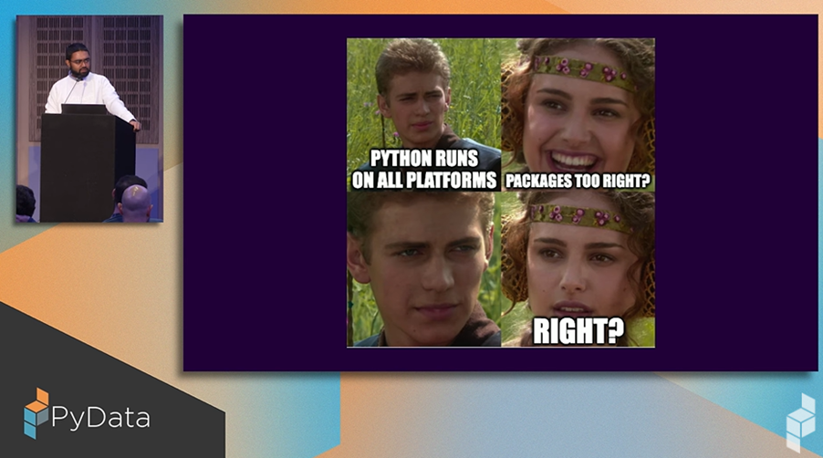

# Understanding software design patterns in Financial Data Science

`Design Patterns` were first introduced in a book titled [Design Patterns: Elements of Reusable Object-Oriented Software](https://www.amazon.com/Design-Patterns-Elements-Reusable-Object-Oriented/dp/0201633612)
, published in 1994 by Erich Gamma, Richard Helm, Ralph Johnson and John Vissides, also known as the `Gang of Four`.
The book lies at the basis of Object-Oriented design theory and practice. A `Design Pattern` is a general, reusable solution to a commonly occurring problem.
One does not just find them in software development, but throughout engineering practice, as
their philosophy is to find standard solutions to common problems in a given field, say, the `Schmidt coupling` in mechanical engineering, see also
 [20 Mechanical Principles combined in a Useless Lego Machine" on YouTube [sic!]](https://www.youtube.com/watch?v=M1-YeqGynlw)

There are, also standard designs for car engines, for instance the four-stroke engine, or the shape of a kitchen sink in plumbing and house design.
This is exactly what design patterns are for software. Each patter solves a particular problem.
Some of these patterns focus in object creation, some of them focus on testing structure, say a system of objects, and some of them focus on how
objects should communicate.

There is only one problem: The book referenced above is about 30 years old and much has changed in the computing world, including the evolution of
programming languages. "Move fast and fail fast" mentality of start-ups, or, often occurring in the quantitative analysis world in finance
the "focus on the question at hand to answer a particular problem, while caring to a lesser degree, or not at all, on the design of the program".
Many Jupyter notebooks that are written in isolation, are a prime example of that. In that sense many data scientists are stuck on the "make it work"
mantra, rather than progressing to "make it right", and, finally, "make it fast". That is not meant as a criticism, as more often than not, we rework, rewrite or re-manufacture entire parts of our code to achieve the "make it work" step and over-designing a piece of code can be seen as an issue in itself, at least at the prototyping, or "prove of concept" stage. For more mature systems this, however, leads to plenty of technical issues, which are difficult or even impossible to maintain.

Also, "Object-Oriented programming" is not a prime style of writing software anymore, and many modern language have solid "functional programming"
support natively supported. One of such as language is Python, where functions are considered first-class citizens, i.e. we can pass them around
like other objects and even make functions take other functions as input parameters.
Some of the patterns introduced in the gang of four book are still useful, for example, the "Bridge" or "Command" pattern, while others, say the
"Singleton" pattern receive less attention nowadays. Also, we can make use of modern features available in Python
(and many other programming languages), for instance higher-order functions, partial function application, data structures
such as dictionaries and tuples, or patterns relying on Python's structural typing and protocol classes.

This blog is aimed at providing an overview of design patterns that one can make use for in Financial Data Science applications.
It does not claim to be exhaustive, and you are encouraged to take a look at the original publication, or even, to take the
concepts provided and to implement them in another language of your choice.


<!-- more -->

## A necessary detour: Unified Modeling Language (UML)
Before we delve into the realm of Design Patterns, we should first describe how we can define objects and properties on the
drawing board, similarly as an architect first works on a blueprint before manifesting their ideas in the real world.
In software architecture one such a tool is the `Unified Modeling Language (UML)`. It is a standardised visual modeling
language used in the field of software engineering to specify, visualize, construct, and document the artifacts of software systems.
UML is not a programming language but rather a tool used to help software developers visualise the design of a system.

### How does UML help us in Software Engineering?

- Visualisation: UML provides software architects and designers with a language for developing clear models of system design. It includes a set of graphic notation techniques to create visual models of object-oriented software systems.

- Standardisation: As a standardised language, UML makes it easier for individuals to understand the software design, whether they are part of the development team or external stakeholders. This helps in both collaborative settings and when transitioning projects between teams.

- Design and documentation: UML diagrams serve as a part of the documentation process, providing several types of diagrams that cater to different aspects of a software system. For example, use case diagrams for requirements gathering, class diagrams for showing static structure, and sequence diagrams for detailing the interactions.

- Problem-solving: By using UML, software developers can think through the design and discover potential issues before any code is actually written. This can save time and resources in the development process.

- Facilitates analysis: UML helps break down complex systems into manageable components, which can be analysed, designed, and implemented independently.

- Platform-agnostic: One of the strengths of UML is that it is platform-independent. This means the same modeling language can be used to design software systems across various platforms.

### Types of UML diagrams

UML includes several types of diagrams, each serving different purposes:

- Structural diagrams (e.g., Class Diagrams, Object Diagrams): Focus on the static aspects of the system.

- Behavioural diagrams (e.g., Use Case Diagrams, Activity Diagrams): Focus on dynamic aspects.

- Interaction diagrams (part of behavioral diagrams, e.g., Sequence Diagrams, Communication Diagrams): Focus specifically on the flow of control and data among the elements in the system.

UML hence is an important tool used across the software development lifecycle, from conceptualisation through to implementation. It helps teams communicate ideas more effectively and builds a foundation for creating a robust architecture. By using UML, developers can ensure that their initial designs can be translated into functional software, making it an important part of modern software engineering practices.


### UML within Jupyter notebooks


Form within Jupyter notebooks, we can make use of a library called `iplantuml` that we can install via pip upon invoking pip install iplantuml.

You can also use it to layout the structure of your software using the package and use that as a basis for a research report or a dissertation. It is in general a good idea to keep a record of the blueprit of your software, specifically if you implement larger works or production systems.
```python
try:
    import iplantuml
except ImportError:
    !pip install iplantuml
    import iplantuml
```

## Design Patterns

### Strategy pattern


<!-- markdownlint-disable-next-line MD036 -->
*The rendered result should look similar to the above figure.*

We can now use this our blueprint and engineer software that implements the abstract pattern.
As an example we pick pricing a European call and put option using the `Black-Scholes-Merton` equation, which is
a common task in pricing a vanilla derivative.

The Black-Scholes equation for a European call option is given by:

$$
c = S_0 N(d_1) - K e^{-rT} N(d_2)
$$

The Black-Scholes equation for a European put option is given by:

$$
p = K e^{-rT} N(-d_2) - S_0 N(-d_1)
$$

where:

$$
d_1 = \frac{\ln(S_0 / K) + (r + \sigma^2 / 2)T}{\sigma \sqrt{T}}
$$

$$
d_2 = d_1 - \sigma \sqrt{T}
$$

- \( c \) is the price of the call option
- \( p \) is the price of the put option
- \( S_0 \) is the current price of the underlying asset
- \( K \) is the strike price of the option
- \( r \) is the risk-free interest rate
- \( T \) is the time to maturity
- \( \sigma \) is the volatility of the underlying asset
- \( N(\cdot) \) is the cumulative distribution function of the standard normal distribution


```python
import numpy as np
from dataclasses import dataclass
from scipy.stats import norm

@dataclass
class BlackScholesOption():
    stock_price: float
    strike_price: float
    time_to_maturity: float
    risk_free_rate: float
    volatility: float

    def compute_d1_d2(self):
        d1 = (np.log(self.stock_price / self.strike_price) +
              (self.risk_free_rate + 0.5 * self.volatility ** 2) * self.time_to_maturity) / (self.volatility * np.sqrt(self.time_to_maturity))
        d2 = d1 - self.volatility * np.sqrt(self.time_to_maturity)
        return d1, d2

    def compute_option_price(self, option_type: str) -> float:
        d1, d2 = self.compute_d1_d2()
        if option_type == "European call":
            price = (self.stock_price * norm.cdf(d1) -
                     self.strike_price * np.exp(-self.risk_free_rate * self.time_to_maturity) * norm.cdf(d2))
        elif option_type == "European put":
            price = (self.strike_price * np.exp(-self.risk_free_rate * self.time_to_maturity) * norm.cdf(-d2) -
                     self.stock_price * norm.cdf(-d1))
        else:
            raise ValueError("Invalid option type. Use 'European call' or 'European put'.")
        return price

def main() -> None:
    option = BlackScholesOption(stock_price=100, strike_price=100, time_to_maturity=1, risk_free_rate=0.05, volatility=0.2)
    print(f"Call price: {option.compute_option_price('European call'):.2f} [monetary units].")
    print(f"Put price: ${option.compute_option_price('European put'):.2f} [monetary units].")
    try:
        print(f"American put price: ${option.compute_option_price('American put'):.2f} [monetary units].")
    except ValueError as e:
        print(f"Error: {e}")


if __name__ == "__main__":
    main()
```


<!-- markdownlint-disable-next-line MD036 -->
*Source: Keynote by Tania Allard at PyData London 2024*

A few talks and sessions at PyData touched on Open Source Software. Tania Allard presented a [keynote](https://www.youtube.com/watch?v=9AuuhrQDv0E&list=PLGVZCDnMOq0rrhYTNedKKuJ9716fEaAdK&index=29) on “[The art of building and sustaining successful OSS tools and infrastructure](https://speakerdeck.com/trallard/2024-pydata-lndn)” discussing factors that contribute to an open-source project’s success and sustainability. She also touched upon how to empower developers, users, and maintainers in a sustainable way and not at the expense of the open-source ecosystem.

Cheuk Ting Ho led an interesting unconference style discussion on “How to define open source AI”. The participants of the unconference were asked to walk through the open source initiative’s conversation [explaining the concept of data information](https://discuss.opensource.org/t/explaining-the-concept-of-data-information/401) and they were asked to put their opinions and questions on it. It was a healthy discussion on Data Information as defined in the draft [Open Source AI](https://opensource.org/blog/open-source-ai-definition-weekly-update-june-17) definition: “Sufficiently detailed information about the data used to train the system, so that a skilled person can recreate a substantially equivalent system using the same or similar data.”

There was also another lightning talk presented on [open source science](https://www.opensource.science/), a NumFOCUS initiative connecting scientists and OSS developers.


<!-- markdownlint-disable-next-line MD036 -->
*Source: Deb Nicholson’s talk at PyData London 2024*

Deb Nicholson presented her thoughts on “[Open source leadership: what to give away and what to bring in](https://www.youtube.com/watch?v=qqZP7OBTL70&list=PLGVZCDnMOq0rrhYTNedKKuJ9716fEaAdK&index=48)”. She provided guidance on steps that the open source leaders can take to establish a balance between the tasks that they do. For example, maintainers or dedicated resources can be responsible for the project’s admin work. Whereas tasks that require a casual timeline and are more enjoyable might be delegated to volunteers. Work that needs constant attention (say, it demands 30-40 hours of time commitment per week) or involves any security risks, should definitely be done by a dedicated staff. As open source projects evolve, they should look for strategies and action plans to reallocate their work in a sustainable way.

## Machine learning with live data

With vast sources of data that are continuously expanding, there is now more interest in training and inferring using real-time data,retrieved directly from edge devices. Using such data introduces its own set of problems, however. These issues may include synchronising data points from the various sensors, preprocessing new data in a timely fashion, ensuring a data ‘source’ can keep up with the application ‘sink’, or vice versa.

Due to the nuance and relative complexity of each application, many ML developers resort to building their own data input pipelines. A major theme from PyData 2024 was live data streaming, aggregation and processing for real-time applications, and many reusable Python building blocks were showcased on this theme.

For streaming and aggregation, attendants were spoilt for choice for low-latency data streaming solutions, with [Bytewax](https://bytewax.io/), [Hopsworks](https://www.hopsworks.ai/) and [CSP](https://docs.cloudera.com/csp-ce/latest/index.html) all presenting solutions. These projects provide reusable building blocks for integrating with various real-time (and offline, for model training) data sources, performing efficient and customisable preprocessing, and presenting to the final data sink as aggregated time-synchronised dataframes.


*Source: [Dask documentation](https://docs.dask.org/en/stable/?wvideo=l9sgt2saht)*

As for parallel processing and analysis, the [DASK](https://www.dask.org/) team showcased their data table processing library; similar to Pandas, that is able to offload processing to multiple nodes on, say, a HPC cluster. With significant performance improvements and a dataframe-like interface, combined with the real-time streaming options above, real-time data analysis is seemingly easier than ever.

## Revolutionising financial time-series forecasting

Time series analysis has always been a classic discipline in statistical science, long before the term “data science” even emerged. This is important across various disciplines ranging from engineering to economics.

Crafting, calibrating and evaluating models for now-casting and forecasting as well as filtering data is as much of an art as it is a science. The talk "[Backtesting and error metrics for modern time series forecasting](https://www.youtube.com/watch?v=dSTXd8Hx728&list=PLGVZCDnMOq0rrhYTNedKKuJ9716fEaAdK&index=47)" by [Kishan Manani](https://github.com/KishManani/PyDataLondon2024) gave an overview on a range of [time-series error metrics](https://link.springer.com/article/10.1007/s10618-022-00894-5) and their pros and cons for different practical applications. The talk also covered issues in back-testing, missing data, sparse data and prediction from multiple time series.

For Bayesian enthusiasts, a talk as well as a hackathon by two of the core developers of [PyMC5](https://www.pymc.io/welcome.html), Chris Fonnesbeck and Thomas Wiecki, was useful and illustrated how [Bayesian computing](https://www.youtube.com/watch?v=99Rmi_CjqME&list=PLGVZCDnMOq0rrhYTNedKKuJ9716fEaAdK&index=12) can be facilitated within the Python framework. There are plenty of well-documented Jupyter notebooks on their [website](https://www.pymc.io/projects/docs/en/stable/learn/core_notebooks/pymc_overview.html) with [examples](https://www.pymc.io/projects/examples/en/latest/gallery.html) from regression, model selection, factor analysis and reliability statistics.


*Source: Figure obtained from [PyMC documentation](https://www.pymc.io/projects/examples/en/latest/introductory/api_quickstart.html)*

Furthermore, there was a talk on [Synthetic Data in Financial Time Series](https://www.youtube.com/watch?v=VXbRP2a0ABg&list=PLGVZCDnMOq0rrhYTNedKKuJ9716fEaAdK&index=39), where [Generative Adversarial Networks (GANs)](https://en.wikipedia.org/wiki/Generative_adversarial_network) were applied to model the evolution of the time series of prices for two types of crude oil. Various commonly used open-access financial datasets were mentioned. This was followed by introducing a machine-learning architecture based on TensorFlow that spans generator, discriminator, encoder and recovery networks. The network was then trained on generating statistically accurate time-series which is useful when data availability, privacy or ethical considerations are a concern.

## The Python ecosystem

Putting the 'Py' in PyData, some talks covered more general aspects of the Python ecosystem. In a humorous talk, Quazi Nafiul Islam gave an overview of the [evolutionary saga of Python packaging](https://youtu.be/95pi4210XAM?si=dY-6IBxAfZCuDojD), from the origins of [Eggs](https://python101.pythonlibrary.org/chapter38_eggs.html) to sophisticated modern tools such as [poetry](https://python-poetry.org/), [PDM](https://pdm-project.org/en/latest/) and [UV](https://astral.sh/blog/uv). He discussed some of the particular challenges relevant to Python packaging, including challenges combining source code and binaries, and cross-platform compatibility. We certainly came away appreciating the progress that has been made with modern tools, and feeling lucky to be Python developers now rather than 20 years ago!


*Source: Quazi Nafiul Islam’s talk at PyData London 2024*

Particularly exciting to members of the RSE team, Andy Fundinger gave an [overview of the python package 'hypothesis'](https://youtu.be/NL7-eNPr_oI?si=WI7II3v5mt7Wz-b4), a [package](https://hypothesis.readthedocs.io/en/latest/) that allows developers to automatically generate unit tests for their functions, and automates the parameterisation of these tests to cover a wide range of inputs and edge cases. We're excited to implement this tool in current and future projects to increase the robustness of our software.

## Honourable mentions


<!-- markdownlint-disable-next-line MD036 -->
*Source: John Sandall’s talk at PyData London 2024*

There were some unique talks that discussed less standard topics in the ML and Data Science space, including a talk by John Sandall about [creating a folk music recommendation system](https://www.youtube.com/watch?v=kifvWDrld2s) using an online sheet music database. The presenter played the violin to demonstrate the types of folk songs the clustering method found in each category, and used LLMs to algorithmically name the clusters.

There was another talk by Wojciech Matejuk with a focus on music, however this time the goal was to take a static MIDI file of a piece of classical piano music and [play it back expressively](https://www.youtube.com/watch?v=nUmLL61OYCc) using a model trained on professional piano players.

Another interesting talk was Antonio Feregrino’s lockdown project aiming to [recommend cards for a competitive Yu-Gi-Oh deck](https://www.youtube.com/watch?v=kYtj7spnppE). This used online data of high-level, competitive players’ decks to recommend similar cards to ones you already have. It also involved a healthy dose of nostalgia for the early 2000s.

One more highlight from the closing hours of PyData 2024 was an [open source drug discovery guide](https://www.youtube.com/watch?v=1H5Xywx0Hz8) by Emlyn Clay. Using almost exclusively open source Python software, Emlyn gave an entertaining walkthrough of the technical drug discovery process in a [Jupyter notebook](https://github.com/EmlynC/emlyn-ipython-notebooks/blob/master/protein_folding_drug_discovery/protein_folding_drug_discovery.ipynb). Using AlphaFold and a host of open source Python packages, we saw how protein folding is used to identify potential targets for drug therapy whilst minimising the use of expensive commercial software.

## Conclusion

Overall, PyData London 2024 had an interesting mix of sessions. There were discussions on best practices in open source communities, new approaches to solving problems, and emerging technologies for data management and processing. We very much look forward to seeing what’s in store next time!

All the talks from the conference are [available to be streamed on YouTube](https://www.youtube.com/playlist?list=PLGVZCDnMOq0rrhYTNedKKuJ9716fEaAdK).
