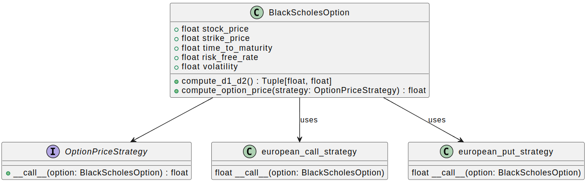

# An example of a software design pattern for financial software using UML diagrams

`Design Patterns` were first introduced in the seminal book [Design Patterns: Elements of Reusable Object-Oriented Software]
(https://www.amazon.com/Design-Patterns-Elements-Reusable-Object-Oriented/dp/0201633612), published in 1994 by #
Erich Gamma, Richard Helm, Ralph Johnson, and John Vlissides—collectively known as the "Gang of Four."
This book forms the foundation of Object-Oriented design theory and practice. A `Design Pattern` is a general, reusable solution to a commonly
occurring problem in software design. These patterns are based on the philosophy of finding standard solutions to common problems in software engineering challenges.

Just as there are standard designs for car engines, like the four-stroke engine, design patterns serve a similar purpose in software.
Each pattern provides a tried-and-true solution to a specific problem.
Some of these patterns focus on object creation, others on structuring systems of objects, and still others on how objects should communicate.

The book referenced above is approximately 30 years old, and much has changed in the computing world since its publication,
including the evolution of programming languages and development methodologies.
The 'move fast and fail fast' mentality of start-ups, and the approach often seen in quantitative analysis within finance—where the focus
is primarily on solving the immediate problem rather than on
the design of the program—are prime examples of this shift. Many Jupyter notebooks, written in isolation, exemplify this mindset, where data scientists are
often stuck on the 'make it work' mantra, without progressing to 'make it right,' and ultimately, 'make it fast.'

This is not meant as a criticism, as the 'make it work' step often involves significant reworking, rewriting, or even re-manufacturing of entire parts of the code.
However, as systems mature, this approach can lead to technical debt, resulting in code that is confusingly difficult to maintain.

This blog post illustrates how the concept of a `Design Pattern` from the early 90ies can be translated to modern day Python. Given the 23 patterns introduced
in the referenced books four `Creational Patterns`, seven `Structural Patterns`, and 11 `Behavioural Patterns` we limit our efforts to one specific pattern,
namely the `Strategy Pattern` which belongs to the class of Behavioural Patterns.

What are the ingredients do we need to be aware of to get started then?
 - i) As the patterns themselves are abstract in nature, we introduce the reader to their architecture via UML diagrams. UML stands for `Unified Modeling Language` and
visualises the way and via what links systems interact with each other. This makes it
particularly useful to visualise software. You might say - we have barely started and yet are off to a detour? Not really - at least not without ulterior motive.
Having fundamental knowledge about UMl diagrams will make it easier to facilitate the transition from the anatomy of the Design Pattern to the actual code, as the
UML diagram serves as the blueprint we use to translate the pattern to code.
 - ii) The definition of the Design Pattern we wish to make use of
 - iii) Some background of the application we apply the Design Pattern to. The author chose a common topic in finance, namely financial derivatives pricing. The derivative we
are interested here are European put and call options. Do not worry yet. We will introduce and explain
the necessary vocabulary as well as the equations we implement as we go along.


<!-- more -->

## Unified Modeling Language (UML)

Before diving into Design Patterns, it is important to first consider how we can define objects and their properties at the conceptual level, much like an architect creates a
blueprint before actual construction begins.
In software architecture, a key tool for this purpose is the Unified Modeling Language (UML).
UML is a standardised modeling language widely used in software engineering to specify, visualise, construct, and document the components of software systems.
While it is not a programming language, UML serves as a helpful tool for helping software developers plan and design software architecture.

### How does UML help us in Software Engineering?

UML includes a set of graphic notation techniques to create visual representations of Object-Oriented software systems.
UML simplifies communication, making it easier for both development teams and external stakeholders to understand the software design and incentivises
forward planning of a structured API, rather than retroactively having to standardise
a badly designed API in the future. This is particularly helpful in a collaborative setting.

Moreover, UML diagrams play an important role in the documentation process, offering various types of diagrams tailored to different aspects of the software.
For instance, use case diagrams are used for requirements gathering, class diagrams depict static structure, and sequence diagrams detail interactions within the system.
UML also helps break down complex systems into manageable components that can be designed, analysed, and implemented independently.
Another key strength of UML is its platform independence, allowing the same modeling language to be used across various platforms, ensuring consistency and flexibility in software design.

### Types of UML diagrams

UML includes several types of diagrams, each serving different purposes:

- Structural diagrams (e.g., class diagrams, object diagrams): Focus on the static aspects of the system.

- Behavioural diagrams (e.g., use case diagrams, activity diagrams): Focus on dynamic aspects.

- Interaction diagrams (part of behavioral diagrams, e.g., sequence diagrams, communication diagrams): Focus specifically on the flow of control and data among the elements in the system.

Thus, UML helps developers engineer and translate their ideas into functional software, serving as a component of modern software engineering practice.

### UML within Jupyter notebooks

From within Jupyter notebooks, one can design UML diagrams using a library called `iplantuml`, that we can install via pip upon invoking `pip install iplantuml`.

```python
try:
    import iplantuml
except ImportError:
    !pip install iplantuml
    import iplantuml
```

## The `Strategy` Design Pattern

The `Strategy Pattern` is used to define a family of algorithms, encapsulate each one, and make them interchangeable.
This pattern allows the algorithm to vary independently of the clients that use it.

The concept of the Strategy Pattern can be outlined as follows.

- Context: This is the class that uses a Strategy. The Context is configured with a ConcreteStrategy object, which it uses to perform a specific algorithm.
- Strategy interface: This defines a common interface for all supported algorithms. The context uses this interface to call the algorithm defined by a ConcreteStrategy.
- ConcreteStrategy: These are the classes that implement the Strategy interface, each providing a specific implementation of the algorithm.

We can code up the UML diagram of the Strategy Pattern as follows.


<!-- markdownlint-disable-next-line MD036 -->
*The rendered result should look similar to the above figure.*

We can now use this our blueprint and engineer software that implements the abstract pattern.
As an example we pick pricing a European call and put option using the `Black-Scholes-Merton` equation, which is
a common task in pricing a vanilla derivative.

Right there, a few terms popped up that may need further elaboration. An `option` is a financial contract that
gives its holder the right, but not the obligation to buy or sell a financial object such as a stock, a commodity, a currency,
or any other `underlying` for a defined, pre-agreed price. An option enabling to buy something at a later date
is named a `call option`, whereas an option enabling to sell something at a later date is called a `put option`

The entity buying the option is called the holder of the option. As no buy can be facilitated without a sell, and vice versa,
we need an entity, say an institution, or any other counterparty issuing the option. This is called the
writer of the option.

Finally, one can distinguish when the option can be exercised against a counterparty. If this is the case only at the date
of expiry, such an option is called `European option`. There are many other variation, say when an option can be exercised
at any time upon purchase or in case of other particularities, but let us not bother with these cases in this tutorial.

Until the 1970ies, there did not exist a published rigorous mathematical framework to determine the fair price of
a European option. In honour of the Economists who are first attributed to find such a framework, their pricing equation is
called the `Black-Scholes (Merton)` equation. It is a stochastic differential equation. In particular, the
Black-Scholes equation is given by:

$$
\frac{\partial V}{\partial t} + \frac{1}{2} \sigma^2 S^2 \frac{\partial^2 V}{\partial S^2} + r S \frac{\partial V}{\partial S} - r V = 0
$$

where:

- \( V \) is the price of the derivative (option price)
- \( t \) is the time
- \( S \) is the price of the underlying asset
- \( \sigma \) is the volatility of the underlying asset
- \( r \) is the risk-free interest rate with continuous compounding (c.c.)

Without proof, the following expressions for the price of a European put and call option solve the Black-Scholes equation:

### European call option price

$$
c = S_0 N(d_1) - K e^{-rT} N(d_2)
$$

### European put option price

$$
p = K e^{-rT} N(-d_2) - S_0 N(-d_1)
$$

where:

$$
d_1 = \frac{\ln(S_0 / K) + (r + \sigma^2 / 2)T}{\sigma \sqrt{T}}
$$

$$
d_2 = d_1 - \sigma \sqrt{T}
$$

- \( c \) is the price of the call option.
- \( p \) is the price of the put option.
- \( S_0 \) is the current price of the underlying asset.
- \( K \) is the strike price of the option.
- \( r \) is the risk-free interest rate.
- \( T \) is the time to maturity.
- \( \sigma \) is the volatility of the underlying asset.
- \( N(\cdot) \) is the cumulative distribution function of the standard normal distribution.

Let us now implement these pricing equations in a Python program using the `Strategy Pattern`.

## Implementation of the Strategy Pattern

We make use of the definition of the Strategy Design Pattern above and adapt it to the problem at hand. We first modify the UML diagram to lay out the architecture and then follow-up
with a code implementation.

### UML diagram



<!-- markdownlint-disable-next-line MD036 -->
*The rendered result should look similar to the above figure.*

Let us go through the `UML diagram` of the `Strategy pattern` in this context in more detail.

In UML diagrams, the `1` and `*` symbols denote multiplicity, which indicates the number of instances in a relationship.
1: This means "exactly one." It indicates that there is a one-to-one relationship.
*: This means "many." It indicates that there is a one-to-many relationship.

- Inheritance:
 `OptionPriceStrategy <|.. EuropeanCallStrategy`
 `OptionPriceStrategy <|.. EuropeanPutStrategy`

  - These lines indicate that `EuropeanCallStrategy` and `EuropeanPutStrategy` both implement the `OptionPriceStrategy` interface. This relationship is depicted using a solid line with a hollow triangle pointing to the interface. It means that both strategies must provide an implementation for the compute_price method defined in the OptionPriceStrategy interface.

- Composition:
`BlackScholesOption "1" *-- "*" OptionPriceStrategy`
This indicates a composition relationship between `BlackScholesOption` and `OptionPriceStrategy`. The `1` near `BlackScholesOption` means that each instance of `BlackScholesOption` can use one or more instances of `OptionPriceStrategy`.
The `*` near `OptionPriceStrategy` means that multiple strategies can be associated with a single `BlackScholesOption` instance.
The filled diamond represents a strong lifecycle dependency, meaning the `OptionPriceStrategy` instances are typically created and destroyed along with the `BlackScholesOption` instance.

- Association:
`Main "1" *-- "1" BlackScholesOption` indicates an association relationship between `Main` and `BlackScholesOption`. The `1` near both `Main` and `BlackScholesOption` signifies a one-to-one relationship.
Each instance of Main is associated with exactly one instance of `BlackScholesOption`. The filled diamond indicates a composition relationship where
`Main` strongly owns or controls the lifecycle of the `BlackScholesOption`.

- Code context:
`OptionPriceStrategy` interface defines a contract for computing option prices.
It has one method, `compute_price`, which takes an instance of `BlackScholesOption` and returns a float.

- `EuropeanCallStrategy` and `EuropeanPutStrategy Classes` implement the `OptionPriceStrategy` interface.
Each provides a specific implementation of the `compute_price` method for `European call and put` options, respectively.

- `BlackScholesOption class` contains attributes for the option parameters (e.g., stock price, strike price, time to maturity, risk-free rate, volatility).
It has a (private) method `_compute_d1_d2` to calculate the `d1` and `d2` values used in the Black-Scholes formula.
The `_compute_option_price` method takes an `OptionPriceStrategy` instance and uses it to compute the option price.

- `Main Class`: Responsible for creating instances of `BlackScholesOption` and the strategy classes (`EuropeanCallStrategy and EuropeanPutStrategy`).
It then uses these to compute and print the option prices

### Python code

Translating the UML diagram to Python code can look like so:

```python
from abc import ABC, abstractmethod
from dataclasses import dataclass
import numpy as np
from scipy.stats import norm
from typing import Tuple

# define the Strategy interface
class OptionPriceStrategy(ABC):
    @abstractmethod
    def compute_price(self, option: 'BlackScholesOption') -> float:
        pass

# implement the European call option pricing strategy
class EuropeanCallStrategy(OptionPriceStrategy):
    def compute_price(self, option: 'BlackScholesOption') -> float:
        d1, d2 = option.compute_d1_d2()
        price = (option.stock_price * norm.cdf(d1) -
                 option.strike_price * np.exp(-option.risk_free_rate * option.time_to_maturity) * norm.cdf(d2))
        return price

# implement the European put option pricing strategy
class EuropeanPutStrategy(OptionPriceStrategy):
    def compute_price(self, option: 'BlackScholesOption') -> float:
        d1, d2 = option.compute_d1_d2()
        price = (option.strike_price * np.exp(-option.risk_free_rate * option.time_to_maturity) * norm.cdf(-d2) -
                 option.stock_price * norm.cdf(-d1))
        return price

# define the context class, representing the Black-Scholes option
@dataclass
class BlackScholesOption:
    stock_price: float
    strike_price: float
    time_to_maturity: float
    risk_free_rate: float
    volatility: float

    # method to compute d1 and d2, which are intermediate calculations for option pricing
    def compute_d1_d2(self) -> Tuple[float, float]:
        d1 = (np.log(self.stock_price / self.strike_price) +
              (self.risk_free_rate + 0.5 * self.volatility ** 2) * self.time_to_maturity) / (self.volatility * np.sqrt(self.time_to_maturity))
        d2 = d1 - self.volatility * np.sqrt(self.time_to_maturity)
        return d1, d2

    # method to compute the option price using the provided strategy
    def compute_option_price(self, strategy: OptionPriceStrategy) -> float:
        return strategy.compute_price(self)

# main function to demonstrate the usage of the Strategy Pattern
def main() -> None:
    # create instances of the pricing strategies
    call_strategy: OptionPriceStrategy = EuropeanCallStrategy()
    put_strategy: OptionPriceStrategy = EuropeanPutStrategy()

    # create a Black-Scholes option with given parameters
    option: BlackScholesOption = BlackScholesOption(
        stock_price=100,
        strike_price=100,
        time_to_maturity=1,
        risk_free_rate=0.05,
        volatility=0.2
    )

    # compute and print the call option price using the call strategy
    call_price: float = option.compute_option_price(call_strategy)
    print(f"Call price: {call_price:.2f} [monetary units].")

    # compute and print the put option price using the put strategy
    put_price: float = option.compute_option_price(put_strategy)
    print(f"Put price: {put_price:.2f} [monetary units].")

if __name__ == "__main__":
    main()
```

In the currency of the contract, under the Black-Scholes model, the price of a European call and put options given the underlying stock are hence:

- Call price: 10.45 [monetary units].
- Put price: 5.57 [monetary units].

Note the separation of concerns:  `EuropeanCallStrategy()` knows nothing about `EuropeanPutStrategy()` and vice versa.
It is hence straight-forward to maintain and extend one part of Strategy without touching the other part.

## Conclusion

In this article, we introduced design patterns and demonstrated how to implement the `Strategy Pattern` using the Object-Oriented paradigm in Python.
We utilised the `@abstractmethod` decorator to define interfaces for different strategies.
To illustrate the practical use of this design pattern, we provided a concrete example from finance, namely pricing European put and call options.

By applying the Strategy Pattern, we achieved a clear separation of concerns, resulting in loosely coupled and maintainable code.
These are key characteristics of high-quality software engineering, ensuring that the code is easier to understand, extend, and modify.

While this article focused on the Strategy design pattern and its practical application in Financial Data Science, specifically in pricing European options,
it did not aim to cover other design patterns. I encourage the reader to explore the original publication for a more comprehensive understanding or to experiment with
implementing the discussed problem in a programming language of your choice.

## Additional material
In addition to the original Gang of Four book, the author of this article can recommend the YouTube channel of computer scientist `Douglas Schmidt`
that features recorded lectures. In particular the
[YouTube playlist about Design Patterns in C++]
(https://www.youtube.com/watch?v=o1SrQ3cJFfg&list=PLZ9NgFYEMxp6p4oC9bP3PZdZ-FAPDeavB&index=2)
will be useful for an audience interested in software engineering with a compiled programming language.
