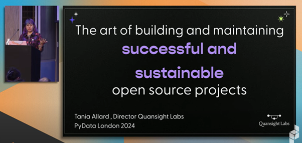
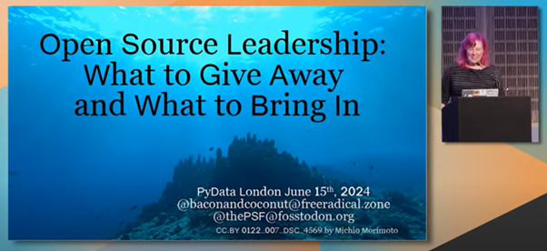
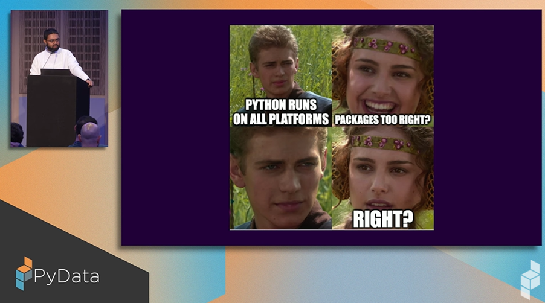
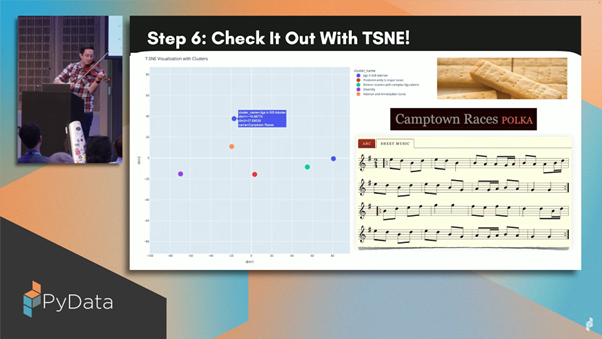

# Highlights from PyData London 2024

The central RSE team at Imperial recently attended the [PyData London 2024](https://pydata.org/london2024/), the 10th Anniversary edition. It was an in-person event that brought together data scientists, data engineers, and developers from around the world. This event served as a platform for sharing ideas and learning from one another. In this blog post, we share our highlights from the event, showcasing why it's essential for anyone involved in data science to stay updated and connected with the global community.

With Artificial Intelligence, in particular Large Language Models (LLMs) being a significant topic in the wider world, it was naturally a very significant topic that was seen across the whole conference. Most talks involved some kind of data processing or Machine Learning workflow. Scratching beneath the surface, we found some additional highlights.

<!-- more -->

## Open source software and community building

A few talks and sessions at PyData touched on Open Source Software. Tania Allard presented a [keynote](https://www.youtube.com/watch?v=9AuuhrQDv0E&list=PLGVZCDnMOq0rrhYTNedKKuJ9716fEaAdK&index=29) on “[The art of building and sustaining successful OSS tools and infrastructure](https://speakerdeck.com/trallard/2024-pydata-lndn)” discussing factors that contribute to an open-source project’s success and sustainability. She also touched upon how to empower developers, users, and maintainers in a sustainable way and not at the expense of the open-source ecosystem.

Cheuk Ting Ho led an interesting unconference style discussion on “How to define open source AI”. The participants of the unconference were asked to walk through the open source initiative’s conversation [explaining the concept of data information](https://discuss.opensource.org/t/explaining-the-concept-of-data-information/401) and they were asked to put their opinions and questions on it. It was a healthy discussion on Data Information as defined in the draft [Open Source AI](https://opensource.org/blog/open-source-ai-definition-weekly-update-june-17) definition: “Sufficiently detailed information about the data used to train the system, so that a skilled person can recreate a substantially equivalent system using the same or similar data.”

There was also another lightning talk presented on [open source science](https://www.opensource.science/), a NumFOCUS initiative connecting scientists and OSS developers.

Deb Nicholson presented her thoughts on “[Open source leadership: what to give away and what to bring in](https://www.youtube.com/watch?v=qqZP7OBTL70&list=PLGVZCDnMOq0rrhYTNedKKuJ9716fEaAdK&index=48)”. She provided guidance on steps that the open source leaders can take to establish a balance between the tasks that they do. For example, maintainers or dedicated resources can be responsible for the project’s admin work. Whereas tasks that require a casual timeline and are more enjoyable might be delegated to volunteers. Work that needs constant attention (say, it demands 30-40 hours of time commitment per week) or involves any security risks, should definitely be done by a dedicated staff. As open source projects evolve, they should look for strategies and action plans to reallocate their work in a sustainable way.

## Machine learning with live data

With vast sources of data that are continuously expanding, there is now more interest in training and inferring using real-time data,retrieved directly from edge devices. Using such data introduces its own set of problems, however. These issues may include synchronising data points from the various sensors, preprocessing new data in a timely fashion, ensuring a data ‘source’ can keep up with the application ‘sink’, or vice versa.

Due to the nuance and relative complexity of each application, many ML developers resort to building their own data input pipelines. A major theme from PyData 2024 was live data streaming, aggregation and processing for real-time applications, and many reusable Python building blocks were showcased on this theme.

For streaming and aggregation, attendants were spoilt for choice for low-latency data streaming solutions, with [Bytewax](https://bytewax.io/), [Hopsworks](https://www.hopsworks.ai/) and [CSP](https://docs.cloudera.com/csp-ce/latest/index.html) all presenting solutions. These projects provide reusable building blocks for integrating with various real-time (and offline, for model training) data sources, performing efficient and customisable preprocessing, and presenting to the final data sink as aggregated time-synchronised dataframes.

](images/pydata_london_2024/dask_document.png)

As for parallel processing and analysis, the [DASK](https://www.dask.org/) team showcased their data table processing library; similar to Pandas, that is able to offload processing to multiple nodes on, say, a HPC cluster. With significant performance improvements and a dataframe-like interface, combined with the real-time streaming options above, real-time data analysis is seemingly easier than ever.

## Revolutionising financial time-series forecasting

Time series analysis has always been a classic discipline in statistical science, long before the term “data science” even emerged. This is important across various disciplines ranging from engineering to economics.

Crafting, calibrating and evaluating models for now-casting and forecasting as well as filtering data is as much of an art as it is a science. The talk "[Backtesting and error metrics for modern time series forecasting](https://www.youtube.com/watch?v=dSTXd8Hx728&list=PLGVZCDnMOq0rrhYTNedKKuJ9716fEaAdK&index=47)" by [Kishan Manani](https://github.com/KishManani/PyDataLondon2024) gave an overview on a range of [time-series error metrics](https://link.springer.com/article/10.1007/s10618-022-00894-5) and their pros and cons for different practical applications. The talk also covered issues in back-testing, missing data, sparse data and prediction from multiple time series.

For Bayesian enthusiasts, a talk as well as a hackathon by two of the core developers of [PyMC5](https://www.pymc.io/welcome.html), Chris Fonnesbeck and Thomas Wiecki, was useful and illustrated how [Bayesian computing](https://www.youtube.com/watch?v=99Rmi_CjqME&list=PLGVZCDnMOq0rrhYTNedKKuJ9716fEaAdK&index=12) can be facilitated within the Python framework. There are plenty of well-documented Jupyter notebooks on their [website](https://www.pymc.io/projects/docs/en/stable/learn/core_notebooks/pymc_overview.html) with [examples](https://www.pymc.io/projects/examples/en/latest/gallery.html) from regression, model selection, factor analysis and reliability statistics.

](images/pydata_london_2024/pymc_plot.png)

Furthermore, there was a talk on [Synthetic Data in Financial Time Series](https://www.youtube.com/watch?v=VXbRP2a0ABg&list=PLGVZCDnMOq0rrhYTNedKKuJ9716fEaAdK&index=39), where [Generative Adversarial Networks (GANs)](https://en.wikipedia.org/wiki/Generative_adversarial_network) were applied to model the evolution of the time series of prices for two types of crude oil. Various commonly used open-access financial datasets were mentioned. This was followed by introducing a machine-learning architecture based on TensorFlow that spans generator, discriminator, encoder and recovery networks. The network was then trained on generating statistically accurate time-series which is useful when data availability, privacy or ethical considerations are a concern.

## The Python ecosystem

Putting the 'Py' in PyData, some talks covered more general aspects of the Python ecosystem. In a humorous talk, Quazi Nafiul Islam gave an overview of the [evolutionary saga of Python packaging](https://youtu.be/95pi4210XAM?si=dY-6IBxAfZCuDojD), from the origins of [Eggs](https://python101.pythonlibrary.org/chapter38_eggs.html) to sophisticated modern tools such as [poetry](https://python-poetry.org/), [PDM](https://pdm-project.org/en/latest/) and [UV](https://astral.sh/blog/uv). He discussed some of the particular challenges relevant to Python packaging, including challenges combining source code and binaries, and cross-platform compatibility. We certainly came away appreciating the progress that has been made with modern tools, and feeling lucky to be Python developers now rather than 20 years ago!

Particularly exciting to members of the RSE team, Andy Fundinger gave an [overview of the python package 'hypothesis'](https://youtu.be/NL7-eNPr_oI?si=WI7II3v5mt7Wz-b4), a [package](https://hypothesis.readthedocs.io/en/latest/) that allows developers to automatically generate unit tests for their functions, and automates the parameterisation of these tests to cover a wide range of inputs and edge cases. We're excited to implement this tool in current and future projects to increase the robustness of our software.

## Honourable mentions

There were some unique talks that discussed less standard topics in the ML and Data Science space, including a talk by John Sandall about [creating a folk music recommendation system](https://www.youtube.com/watch?v=kifvWDrld2s) using an online sheet music database. The presenter played the violin to demonstrate the types of folk songs the clustering method found in each category, and used LLMs to algorithmically name the clusters.

There was another talk by Wojciech Matejuk with a focus on music, however this time the goal was to take a static MIDI file of a piece of classical piano music and [play it back expressively](https://www.youtube.com/watch?v=nUmLL61OYCc) using a model trained on professional piano players.

Another interesting talk was Antonio Feregrino’s lockdown project aiming to [recommend cards for a competitive Yu-Gi-Oh deck](https://www.youtube.com/watch?v=kYtj7spnppE). This used online data of high-level, competitive players’ decks to recommend similar cards to ones you already have. It also involved a healthy dose of nostalgia for the early 2000s.

One more highlight from the closing hours of PyData 2024 was an [open source drug discovery guide](https://www.youtube.com/watch?v=1H5Xywx0Hz8) by Emlyn Clay. Using almost exclusively open source Python software, Emlyn gave an entertaining walkthrough of the technical drug discovery process in a [Jupyter notebook](https://github.com/EmlynC/emlyn-ipython-notebooks/blob/master/protein_folding_drug_discovery/protein_folding_drug_discovery.ipynb). Using AlphaFold and a host of open source Python packages, we saw how protein folding is used to identify potential targets for drug therapy whilst minimising the use of expensive commercial software.

## Conclusion

Overall, PyData London 2024 had an interesting mix of sessions. There were discussions on best practices in open source communities, new approaches to solving problems, and emerging technologies for data management and processing. We very much look forward to seeing what’s in store next time!

All the talks from the conference are [available to be streamed on YouTube](https://www.youtube.com/playlist?list=PLGVZCDnMOq0rrhYTNedKKuJ9716fEaAdK).
