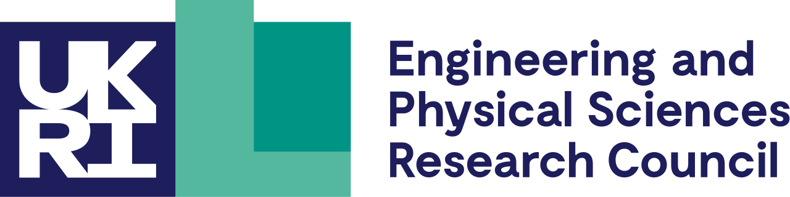

# The RSLondonSouthEast 2024 Workshop

Celebrating its fifth year, [the RSLondonSouthEast workshop returned] to Imperial College's South Kensington campus. [Imperial's RSE team] was well represented, with the event drawing RSEs and academics from across London and the South East of England. This year's conference was organised by [Jeremy Cohen], from Imperial College, and [Ilektra Christidi] from UCL. <!-- TODO: Check with Jeremy that this is true ;-) -->

[RSLondonSouthEast] (formerly RSLondon) is a [regional RSE Community], seeking to bring together those involved in developing and using research software. This includes anyone who writes code as part of their research, as well as those in formal Research Software Engineering roles. It aims to provide opportunities for networking and technical training through workshops, while also advocating for improved career models for RSEs.

As it has in previous years, the workshop continues to provide a welcoming and valuable platform for anyone involved in research software.

[the RSLondonSouthEast workshop returned]: https://rslondon.ac.uk/rslondonsoutheast2024
[Imperial's RSE team]: https://www.imperial.ac.uk/admin-services/ict/self-service/research-support/rcs/service-offering/research-software-engineering/about-the-team
[Jeremy Cohen]: https://profiles.imperial.ac.uk/jeremy.cohen
[Ilektra Christidi]: https://profiles.ucl.ac.uk/8151
[RSLondonSouthEast]: https://rslondon.ac.uk
[regional RSE Community]: https://society-rse.org/community/regional-groups/

<!-- more -->

## Keynote Presentation

[Marion Weinzierl] from the [Institute of Computing for Climate Science] at the University of Cambridge presented the Keynote for the workshop: "Leading from within the research technical professionals community". She told the story of how the RSE movement evolved from small grassroots groups to having national and international career pathways for RSEs.

Despite the RSE movement's successes, she emphasised that there was still work to be done. In a call to action, she illustrated the diverse ways in which individuals within the RSE community can lead. It could be through organising events, leading or contributing to a sub-community, becoming a mentor[^1], reviewing grants, finding like-minded people in working groups and special interest groups or leading on a topic that they are passionate about, whether tech or non-tech related.

[^1]: Both [SocRSE] and [WHPC] provide mentoring programmes.

[Marion Weinzierl]: https://iccs.cam.ac.uk/about-marion-weinzierl
[Institute of Computing for Climate Science]: https://iccs.cam.ac.uk
[SocRSE]: https://society-rse.org/get-involved/mentoring-scheme/
[WHPC]: https://womeninhpc.org/community/mentoring

*Source: Marion Weinzierl presenting her keynote at RSLondonSouthEast 2024*

## Regional Research Software Communities

This workshop is a great example of the value that can be provided by [regional RSE groups](https://society-rse.org/community/regional-groups/). It gave the attendees the opportunity to connect with RSEs from other univiersities in the region. Below we've highlighted some people we met.

[Diego Alonso Álvarez] is the RSE Team Lead at [Imperial College London]. A physicist by training with specialty in semiconductor nanostructures, he has led ICL's RSE team since 2021.

[Sherman Lo] is an RSE at [Queen Mary University of London]. Sherman has an interest in computational statistics and machine larning and facilitates GPU programming using CUDA.

[Mahmoud Abdelrazek] is a Senior Research Data Consultant at [Advanced Research Computing Centre] [University College of London]. He is interested in building flexible and scalable data pipelines.

[Louise Bowler] is a Senior RSE at [King's College London]. Louise has an interest in sustainable software and data science, both in academia and government.

[Jamie Knight] is an [EPSRC] Research Software Engineering Fellow at the University of Sussex. For a number of years, he has been the maintainer and primary developer for [GeNN] ("GPU Enhanced Neuronal Network"), a library for simulating spiking neural networks on GPUs (and CPUs).

### Sponsor Talks

Tony Chapman and Evelina Gabasova presented sponsor talks from [UKRI-EPSRC] and the [Society of Research Software Engineering], respectively.

### Panel discussion

There was a panel session on "Research Software Technical Professionals Showcase: Highlighting the contribution of technical roles in modern research" where each panellist represented a different area of the developing digital Research Technical Professional (dRTP) field:
<!-- The section on the panel discussion is is a bit brief -- maybe Jeremy has something to add? -->

Mahmoud Abdelrazek, UCL
Tony Chapman, UKRI-EPSRC
Arianna Ciula, King’s College London
Gwen Dawes, University of Cambridge
Emily Lumley, Imperial College London

[Diego Alonso Álvarez]: https://profiles.imperial.ac.uk/d.alonso-alvarez
[Imperial College London]: https://www.imperial.ac.uk/admin-services/ict/self-service/research-support/rcs/service-offering/research-software-engineering/
[Sherman Lo]: https://blog.hpc.qmul.ac.uk/intro-sherman-lo.html
[Queen Mary University of London]: https://www.qmul.ac.uk/its/its-research/team-members/research-software-engineer-rse-team/
[Mahmoud Abdelrazek]: https://www.razekmh.dev
[University College of London]: https://www.ucl.ac.uk/advanced-research-computing/research-software-engineers
[Louise Bowler]: https://www.kcl.ac.uk/people/louise-bowler
[King's College London]: https://docs.er.kcl.ac.uk/research_software_engineering/
[Jamie Knight]: https://profiles.sussex.ac.uk/p415734-james-knight
[EPSRC]: https://www.ukri.org/councils/epsrc/
[GeNN]: http://genn-team.github.io
[Advanced Research Computing Centre]: https://www.ucl.ac.uk/advanced-research-computing/
[UKRI-EPSRC]: https://www.ukri.org/councils/epsrc/
[Society of Research Software Engineering]: https://society-rse.org/

## RSE Team Presentations

The [Imperial College RSE Team] was well-represented at the workshop, with four of us presenting a talk or a poster. Each poster involved a 1-2 minute lightning talk introducing the poster and inviting the attendees to come talk.

Adrian D'Alessandro presented a poster on [The HPC and RSE Experience Programme], an initiative by the [Imperial College Research Computing Service] to provide an early career entry-point into RTP careers. The programme is a six-month job working as an RSE and working alongside the HPC system administrators and user support staff. This presentation was taken as an opportunity to share the idea in the hope that other universities would also start similar programmes of their own.

Ryan Smith from the RSE Team and Chris Cooling from the [Graduate School] co-presented a [talk] on [ReCoDE]. ReCoDE is an online collection of research computing and data science exemplars, developed to enhance students' software engineering skills and provide robust, maintainable research software. Students develop the exemplars in collaborative projects with support from graduate teaching assistants and research software engineers. For a sample project in the field of Financial Data Science carried out by two of Imperial's RSE team members, Benjamin Scharpf and James Turner, [see here].

Saranjeet Kaur Bhogal [presented] and [poster] on the [R Development Guide], which is a resource designed to onboard new contributors to the R project, making the transition smoother and more accessible.

In the last [talk][talk_diego] of the day, [Diego Alonso Álvarez], head of Imperial's RSE Team, presented data on the financial and environmental impact of excessive continuous integration usage. He offers easy low hanging solutions, and encourages us to be more selective on which Github action runners are used -- for example by removing redundant OS and software permutations. These ideas, as well as others discussed in a [previous post], were the result of a critical exercise done by the whole RSE Team, and the different measures, like reducing the number of jobs or caching, have been rolled out to most of the GitHub repositories managed by the Team. [The associated poster] received the Audience’s Best Poster award!

*Sign up to the [RSLondon mailing  list] and [Join the Society of RSE]*

[Imperial College RSE Team]: https://www.imperial.ac.uk/admin-services/ict/self-service/research-support/rcs/service-offering/research-software-engineering/about-the-team/
[The HPC and RSE Experience Programme]: https://www.imperial.ac.uk/admin-services/ict/self-service/research-support/rcs/about/jobs/hpc_rse_experience_programme/
[Imperial College Research Computing Service]: https://www.imperial.ac.uk/admin-services/ict/self-service/research-support/rcs/
[Graduate School]: https://www.imperial.ac.uk/students/academic-support/graduate-school/professional-development/doctoral-students/research-computing-data-science/meet-the-team/
[talk]: https://zenodo.org/records/13167550
[ReCoDE]: https://imperialcollegelondon.github.io/ReCoDE-home/exemplars/
[see here]: https://imperialcollegelondon.github.io/ReCoDE-DecodingMarketSignals/
[presented]: https://rslondon.ac.uk/rslondonsoutheast2024/abstracts/#ft4
[poster]: https://zenodo.org/records/12731887
[R Development Guide]: https://contributor.r-project.org/rdevguide/
[talk_diego]: https://rslondon.ac.uk/rslondonsoutheast2024/abstracts/#ft7
[previous post]: https://imperialcollegelondon.github.io/RSEBlog/2024/06/26/adopting-a-more-rational-use-of-continuous-integration-with-github-actions/
[The associated poster]: https://zenodo.org/records/12754189
[RSLondon mailing  list]: https://rslondon.ac.uk/mailing-list
[Join the Society of RSE]: https://society-rse.org/join-us/
